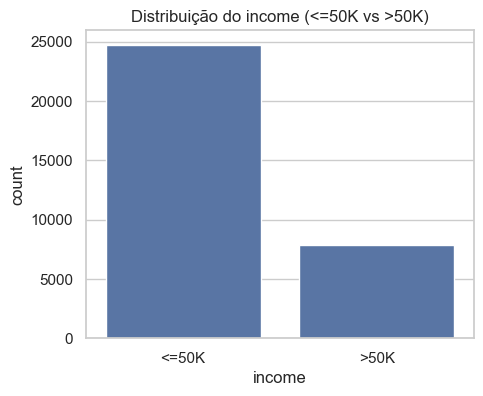
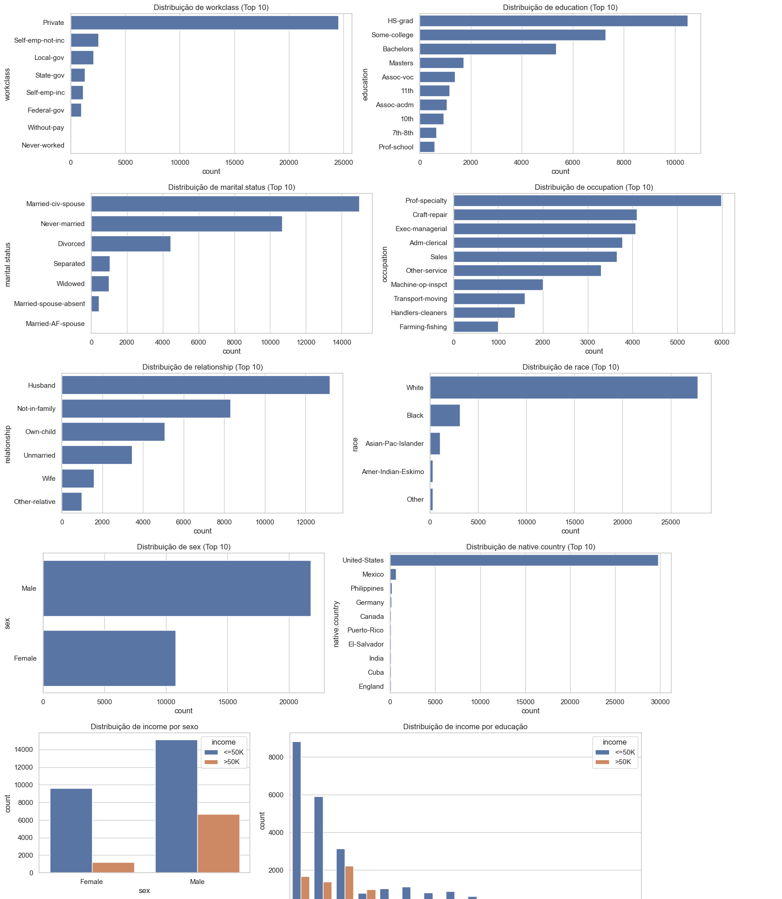
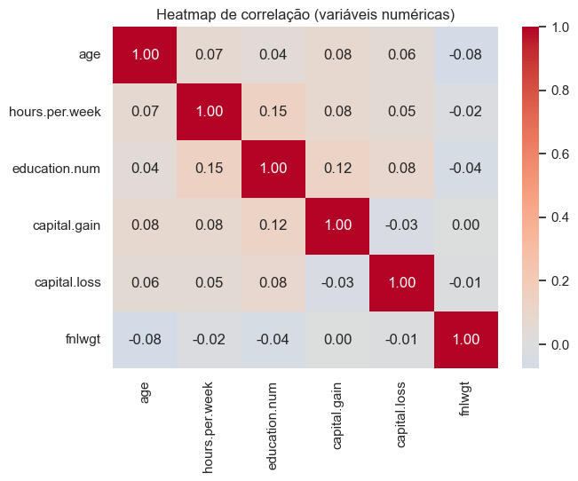
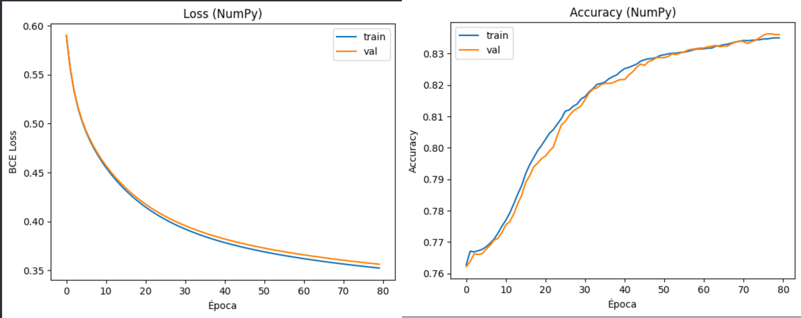
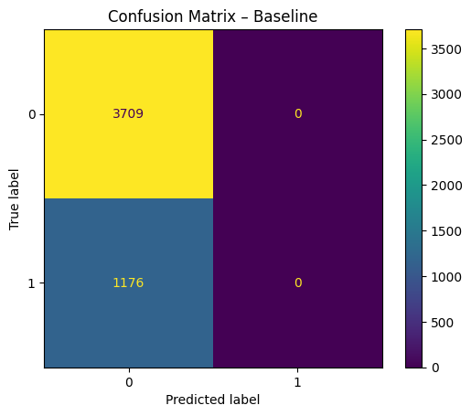
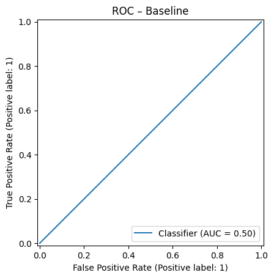
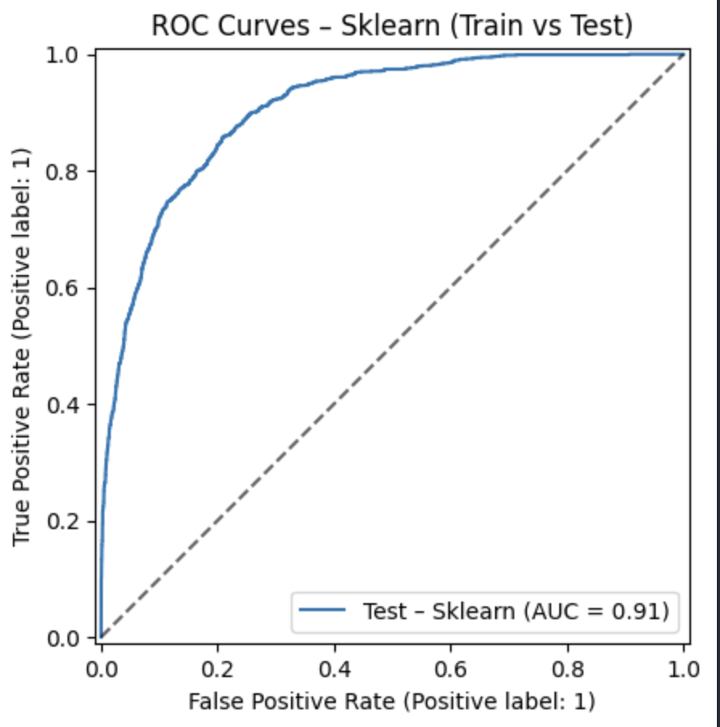
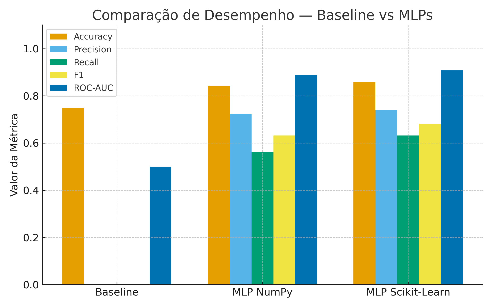

# MLP no Adult Income — Relatório

---

## 1) Objetivo

Neste projeto, buscamos prever se a renda anual de uma pessoa é **>50K** ou **<=50K** utilizando o conjunto **Adult Income**.  
Trata-se de um problema de **classificação binária** com amostra ampla (30k+ observações) e múltiplos atributos, majoritariamente categóricos.

- Não utilizamos datasets clássicos superexpostos (Titanic/Iris/Wine).
- Implementamos um **MLP em NumPy**.

---

## 2) Dataset Selection

**Nome do dataset:** *Adult Income (Census Income)*

**Fonte:** [UCI Machine Learning Repository](https://www.kaggle.com/datasets/uciml/adult-census-income)

**Tamanho utilizado:** aproximadamente **30 000 registros** após limpeza, com cerca de **105 variáveis** numéricas/categóricas (após codificação one-hot) e **1 variável-alvo** (`income`).

**Descrição:** O Adult Census Income Dataset, também conhecido como Census Income ou Adult dataset, foi extraído do Censo norte-americano de 1994 e tem como objetivo prever se a renda anual de um indivíduo ultrapassa US$ 50.000, com base em variáveis demográficas e profissionais. Trata-se de um problema clássico de classificação binária, amplamente utilizado para avaliar métodos de pré-processamento, tratamento de desbalanceamento e modelagem supervisionada em aprendizado de máquina.

**Motivação da escolha:** é um problema **realista e amplamente estudado** em aprendizado de máquina, útil para explorar técnicas de **classificação supervisionada**, **tratamento de desbalanceamento**, e **engenharia de variáveis categóricas**. Além disso, sua **complexidade moderada** (número alto de atributos após codificação) e **desbalanceamento entre classes** tornam o dataset adequado para avaliar métricas além da acurácia, alem de aplicarmos os conhecimentos adquiridos na disciplina.


---

## 3) Dataset Explanation

Todas as exploracoes e processos feitos nesse data set esta no arquivo : (https://github.com/marinnagc/classification_mlp_mng/blob/main/exploracao.ipynb)

### 3.1) Descriptive Statistics

As variáveis numéricas apresentam escalas e distribuições bastante distintas. A média de idade é de aproximadamente 38,6 anos, com desvio padrão de 13,6, indicando uma amostra adulta heterogênea. A jornada média semanal é de 40 horas, coerente com o padrão de tempo integral.
A variável education.num tem média 10, correspondente a um nível educacional médio entre Some College e Bachelors.
Os atributos capital-gain e capital-loss são altamente assimétricos, com a maior parte dos valores igual a zero — o que indica que apenas uma pequena fração da população declarou ganhos ou perdas de capital relevantes.

| Variável       | Média   | Desvio padrão | Mínimo | Máximo    |
| -------------- | ------- | ------------- | ------ | --------- |
| age            | 38.6    | 13.6          | 17     | 90        |
| hours.per.week | 40.4    | 12.3          | 1      | 99        |
| education.num  | 10.1    | 2.6           | 1      | 16        |
| capital.gain   | 1077.6  | 7385.3        | 0      | 99999     |
| capital.loss   | 87.3    | 403.0         | 0      | 4356      |
| fnlwgt         | 189,778 | 105,550       | 12,285 | 1,484,705 |


### 3.2)  Target Distribution

A variável-alvo (income) é desbalanceada, com cerca de 75% dos indivíduos recebendo até US$ 50K e 25% acima desse valor.
Isso sugere a necessidade de métricas de avaliação além da acurácia, como F1-score, ROC AUC e Precision–Recall AUC.



### 3.3)  Categorical Variables


Ao analisar as variaveis categoricas, a maior parte dos indivíduos pertence à classe de trabalho “Private”, seguida de trabalhadores autônomos (Self-emp-not-inc e Self-emp-inc) e servidores públicos (Local-gov e State-gov).


Em termos de ocupação, destacam-se “Prof-specialty”, “Craft-repair” e “Exec-managerial”, representando setores de maior qualificação.
A esmagadora maioria dos registros refere-se a pessoas nascidas nos Estados Unidos, com poucos exemplos de outros países.

Podemos prover isso com o grafico abaixo:





### 3.4)  Correlation Matrix

O heatmap de correlação mostra que não há relações lineares fortes entre as variáveis numéricas.
A maior correlação observada é entre education.num e hours.per.week (r ≈ 0.15), ainda assim bastante baixa.
Isso sugere que cada atributo contribui de forma relativamente independente para o modelo, o que pode favorecer métodos que capturam interações não lineares (como árvores de decisão e ensemble models).




## 4) Data Cleaning and Normalization

Esse processo foi feito em :(https://github.com/marinnagc/classification_mlp_mng/blob/main/limpeza.ipynb)

Durante a etapa de limpeza, substituímos todos os valores representados por “?” por None e preenchemos os valores ausentes com a moda de cada coluna (valor mais frequente).
Essa estratégia preserva a distribuição original dos dados e evita distorções que poderiam surgir com imputações baseadas em média ou mediana.

Na normalização, aplicamos o Z-score às variáveis numéricas, de forma que cada atributo passou a ter média 0 e desvio padrão 1, garantindo uma escala uniforme entre variáveis como age, hours-per-week e capital-gain.


Before → After

| age | workclass | capital.gain | hours.per.week |
| --- | --------- | ------------ | -------------- |
| 39  | ?         | 0            | 40             |
| 50  | Private   | 7688         | 60             |
| 28  | ?         | 0            | 40             |

Após limpeza e normalização:

| age (z) | workclass | capital.gain (z) | hours.per.week (z) |
| ------- | --------- | ---------------- | ------------------ |
| -0.10   | Private   | -0.12            | -0.04              |
| 0.85    | Private   | 1.75             | 1.53               |
| -1.05   | Private   | -0.12            | -0.04              |


## 5) MLP Implementation


Neste projeto, foram utilizadas duas implementações de **MLP (Perceptron Multicamadas)**:
uma com a biblioteca **scikit-learn**, para referência e benchmarking,
e outra **implementada manualmente em NumPy**, para demonstrar os princípios de *forward pass*, *backpropagation* e *early stopping*.

### 🔹 MLP com scikit-learn

```python
# mlp_biblio.py
import numpy as np
from sklearn.neural_network import MLPClassifier

class SklearnMLPModel:
    """MLP com scikit-learn: interface comum .fit(), .predict_proba(), .predict(), .loss_curve()."""
    def __init__(self,
                 hidden_layer_sizes=(64,),
                 lr=1e-3,
                 alpha=1e-4,
                 batch_size=128,
                 max_iter=100,
                 early_stopping=True,
                 random_state=42):
        self.clf = MLPClassifier(
            hidden_layer_sizes=hidden_layer_sizes,
            activation="relu",
            solver="adam",
            learning_rate_init=lr,
            batch_size=batch_size,
            max_iter=max_iter,
            alpha=alpha,             # Regularização L2
            early_stopping=early_stopping,
            n_iter_no_change=10,
            random_state=random_state
        )
        self.fitted_ = False

    def fit(self, X_tr, y_tr):
        self.clf.fit(X_tr, y_tr)
        self.fitted_ = True
        return self

    def predict_proba(self, X):
        assert self.fitted_, "Treine o modelo antes de prever."
        return self.clf.predict_proba(X)[:, 1]

    def predict(self, X, thr=0.5):
        proba = self.predict_proba(X)
        return (proba >= thr).astype(int)

    def loss_curve(self):
        return getattr(self.clf, "loss_curve_", None)
```

**Principais hiperparâmetros:**

* `hidden_layer_sizes`: define o número de neurônios por camada oculta (ex.: `(64,)` → 1 camada com 64 unidades).
* `lr` (`learning_rate_init`): taxa de aprendizado usada pelo otimizador *Adam*. Controla o tamanho do passo nas atualizações de peso.
* `alpha`: termo de regularização L2 (*weight decay*), que ajuda a evitar *overfitting*.
* `batch_size`: tamanho do mini-lote durante o treinamento (padrão = 128).
* `max_iter`: número máximo de épocas (iterações completas sobre o conjunto de treino).
* `early_stopping`: interrompe o treinamento se não houver melhora na validação por várias épocas.
* `random_state`: semente para reprodutibilidade dos resultados.

---

### 🔹 MLP implementado manualmente (NumPy)

```python
# mlp_manual.py
import numpy as np

def _sigmoid(z): return 1 / (1 + np.exp(-z))
def _relu(z): return np.maximum(0, z)
def _relu_grad(z): return (z > 0).astype(z.dtype)

def _bce_loss(y_true, y_pred, eps=1e-12):
    y_pred = np.clip(y_pred, eps, 1 - eps)
    return -np.mean(y_true*np.log(y_pred) + (1-y_true)*np.log(1-y_pred))

class _MLPBinary:
    """MLP de uma camada oculta: ReLU → Sigmoid, perda BCE, SGD mini-batch, L2 e early-stopping."""
    def __init__(self, n_in, n_hidden=64, lr=1e-3, l2=1e-4, seed=42):
        rng = np.random.default_rng(seed)
        # Inicialização He para W1 (ReLU) e Xavier para W2
        self.W1 = rng.normal(0, np.sqrt(2.0/n_in), size=(n_in, n_hidden))
        self.b1 = np.zeros((n_hidden,))
        self.W2 = rng.normal(0, np.sqrt(1.0/n_hidden), size=(n_hidden, 1))
        self.b2 = np.zeros((1,))
        self.lr, self.l2 = lr, l2

    def forward(self, X):
        z1 = X @ self.W1 + self.b1
        a1 = _relu(z1)
        z2 = a1 @ self.W2 + self.b2
        yhat = _sigmoid(z2).ravel()
        return yhat, (X, z1, a1, z2, yhat)

    def backward(self, cache, y_true):
        X, z1, a1, z2, yhat = cache
        N = X.shape[0]
        y_true = y_true.reshape(-1, 1)
        yhat = yhat.reshape(-1, 1)

        dz2 = (yhat - y_true) / N
        dW2 = a1.T @ dz2 + self.l2 * self.W2
        db2 = dz2.sum(axis=0)

        da1 = dz2 @ self.W2.T
        dz1 = da1 * _relu_grad(z1)
        dW1 = X.T @ dz1 + self.l2 * self.W1
        db1 = dz1.sum(axis=0)

        # Atualização dos pesos
        self.W2 -= self.lr * dW2
        self.b2 -= self.lr * db2
        self.W1 -= self.lr * dW1
        self.b1 -= self.lr * db1

    def predict_proba(self, X):
        yhat, _ = self.forward(X)
        return yhat
```

---

**Principais hiperparâmetros:**

* `n_hidden`: número de neurônios na camada oculta (capacidade do modelo).
* `lr`: *learning rate* (taxa de aprendizado); controla o quão rápido os pesos são atualizados.
* `l2`: coeficiente de regularização L2 (penaliza pesos grandes, reduz *overfitting*).
* `batch_size`: tamanho dos mini-lotes de dados usados em cada atualização.
* `epochs`: número máximo de épocas de treinamento.
* `patience`: número de épocas sem melhora antes do *early stopping*.
* `seed`: semente para reprodutibilidade.

---

### 🔹 Aplicacao:

Utilizamos esse dois arquivos nesse jupyter: (https://github.com/marinnagc/classification_mlp_mng/blob/main/main.ipynb)


---
## 6)  Training and Testing Strategy

Os dados foram divididos em **70% para treino**, **15% para validação** e **15% para teste**, garantindo **estratificação da variável-alvo (`income`)** para manter a proporção entre as classes nas três partições.
Essa separação permite usar o conjunto de validação para ajuste de hiperparâmetros (como número de neurônios, taxa de aprendizado, regularização) e o conjunto de teste apenas para avaliação final.

```python
# Divisão 70/15/15 estratificada e normalização/one-hot
y = (df["income"].astype(str) == ">50K").astype(int)
X = df.drop(columns=["income"])

X_train_val, X_test, y_train_val, y_test = train_test_split(
    X, y, test_size=0.15, random_state=42, stratify=y
)

X_train, X_val, y_train, y_val = train_test_split(
    X_train_val, y_train_val, test_size=0.1765, random_state=42, stratify=y_train_val
)

prep = Preprocessor(NUM_COLS, CAT_COLS)
X_train_proc = prep.fit_transform(X_train)
X_val_proc   = prep.transform(X_val)
X_test_proc  = prep.transform(X_test)
```

###  🔹 Treinamento

O modelo foi treinado com **mini-batches de 128 amostras**, equilibrando **velocidade de convergência** e **estabilidade numérica** — mais eficiente que o treinamento *batch* completo (que é mais lento) e menos ruidoso que o *online* (stochastic).


```python
# Treinando e avaliar o MLP (scikit-learn)
from mlp import SklearnMLPModel
from sklearn.metrics import classification_report, roc_auc_score, average_precision_score

skl = SklearnMLPModel(hidden_layer_sizes=(64,), lr=1e-3, alpha=1e-4,
                      batch_size=128, max_iter=100, early_stopping=True, random_state=42)

skl.fit(X_train_proc, y_train)

y_val_pred = skl.predict(X_val_proc)
y_test_pred = skl.predict(X_test_proc)
y_test_proba = skl.predict_proba(X_test_proc)

print("ROC-AUC (test):", roc_auc_score(y_test, y_test_proba))
print("AP (PR AUC, test):", average_precision_score(y_test, y_test_proba))
print(classification_report(y_test, y_test_pred))
```

Alem disso, fizemos o mesmo para NumPy tambem:

```python

#Treinando e avaliando o MLP (agora com Numpy)

from mlp_manual import NumpyMLPModel
from sklearn.metrics import (
    classification_report, roc_auc_score, average_precision_score,
    ConfusionMatrixDisplay, RocCurveDisplay, PrecisionRecallDisplay
)
import matplotlib.pyplot as plt

# ===== Treino =====
npmlp = NumpyMLPModel(n_hidden=64, lr=1e-3, l2=1e-4, batch_size=128, epochs=80, patience=8, seed=42)
npmlp.fit(X_train_proc, y_train_np, X_val_proc, y_val_np)

# ===== Predições TEST =====
y_test_proba_np = npmlp.predict_proba(X_test_proc)
y_test_pred_np  = npmlp.predict(X_test_proc)

# ===== Predições TRAIN =====
y_train_proba_np = npmlp.predict_proba(X_train_proc)
y_train_pred_np  = (y_train_proba_np >= 0.5).astype(int)

```

Sendo assim, tivemos como resultado:

### 🔹 Estratégias contra overfitting

* **Early stopping:** interrompe o treino ao detectar estagnação na validação.
* **Regularização L2 (`alpha=1e-4`):** reduz magnitudes dos pesos.
* **Validação separada (15%)**: usada apenas para monitorar desempenho e ajustar hiperparâmetros.
* **Random seed (`random_state=42`):** garante reprodutibilidade dos resultados.

---

**Resumo da configuração:**

| Parâmetro        | Valor    | Descrição                                  |
| ---------------- | -------- | ------------------------------------------ |
| Split            | 70/15/15 | treino / validação / teste (estratificado) |
| Batch size       | 128      | mini-batch SGD                             |
| Learning rate    | 1e-3     | inicial do otimizador Adam                 |
| Regularização L2 | 1e-4     | evita overfitting                          |
| Early stopping   | Sim      | paciência de 10 épocas                     |
| Random seed      | 42       | reprodutibilidade                          |


## 7) Error Curves and Visualization

Com os metodos adotados, tivemos como resultado:





A loss diminui rapidamente nas primeiras épocas e se estabiliza após ~50, indicando convergência.
A acurácia cresce de forma contínua até cerca de 0.83, com curvas de treino e validação próximas — mostrando boa generalização e sem sinais de overfitting.


### Leitura


-> As curvas tendem a apresentar queda acentuada nas primeiras épocas e estabilização posterior.  

-> Um distanciamento significativo entre treino e validação indica sobreajuste.


---

## 8)  Evaluation Metrics

Nesta seção, são apresentados os resultados quantitativos e visuais obtidos na classificação da variável-alvo `income` (>50K vs <=50K), comparando o **modelo baseline** com os dois **modelos MLP** (NumPy e Scikit-learn).

---

### Baseline ( prevê `<=50K`)

O baseline serve como ponto de referência, representando um classificador que sempre escolhe a classe majoritária.

<p align="center">
  
  
</p>

```
               precision    recall  f1-score   support

           0      0.759     1.000     0.863      3709
           1      0.000     0.000     0.000      1176

    accuracy                          0.759      4885
   macro avg      0.380     0.500     0.432      4885
weighted avg      0.576     0.759     0.655      4885
```

**Interpretação:**
O baseline atinge **acurácia de 0.76**, mas isso se deve apenas ao **desbalanceamento de classes** (a maioria pertence a `<=50K`).
Ele **não consegue identificar nenhum exemplo da classe >50K**, resultando em **precisão, recall e F1 = 0** para a classe positiva e **AUC = 0.50** (equivalente a um classificador aleatório).

---

### Modelos MLP — Resultados no Conjunto de Teste

| Modelo                 | Accuracy | Precision | Recall | F1    | ROC-AUC |
| ---------------------- | -------- | --------- | ------ | ----- | ------- |
| **MLP Manual (NumPy)** | 0.843    | 0.723     | 0.561  | 0.632 | 0.889   |
| **MLP Scikit-Learn**   | 0.858    | 0.741     | 0.632  | 0.682 | 0.908   |

---

### Visualizações de Desempenho

<p align="center">
  
</p>

**Observações:**

* A **curva ROC (AUC ≈ 0.91)** indica **forte capacidade de separação** entre as duas classes.
* A **curva Precision–Recall (AP ≈ 0.78)** é mais informativa em dados desbalanceados: o modelo mantém **alta precisão até ~0.6 de recall**.
* As **matrizes de confusão** (não mostradas aqui em detalhe) revelam que os erros se concentram em falsos negativos (classe >50K prevista como <=50K), refletindo o desbalanceamento do dataset.

---

### Comparação Geral

<p align="center">
  
</p>

**Análise:**

* Ambos os MLPs superam o baseline em todas as métricas, com ganhos significativos em **precisão**, **recall**, **F1** e **AUC**.
* O **MLP Scikit-Learn** apresentou desempenho ligeiramente superior, com **melhor recall (+0.07)** e **F1 (+0.05)**, indicando **maior equilíbrio** entre as classes.
* O **MLP Manual (NumPy)** obteve resultados muito próximos, validando a implementação e o processo de otimização.
* O **recall ainda moderado** na classe positiva (>50K) reflete o impacto do desbalanceamento — um ponto que poderia ser melhorado com **ajuste de threshold** ou **técnicas de reamostragem (SMOTE, class weights)**.

  
---

## 9) Conclusions

- O MLP superou o **baseline** de 0,75, alcançando cerca de **0,84** de acurácia em teste, com **F1** competitivo.  
- Em dados desbalanceados, **F1** e **PR-AUC** complementam a leitura de **accuracy**.  
- O ajuste de **threshold** permite calibrar o compromisso **precisão vs. recall** conforme o custo de FP/FN.  
- Possibilidades de avanço incluem **pesos por classe** na BCE, **tuning** (número de camadas/neurônios, `lr`, `l2`), **agrupamento de categorias raras** (e.g., `native-country`) e, em bibliotecas, **dropout** e **batch normalization**.

---

## 10)  Reprodutibilidade

1. Geramos **`adult_clean.csv`** (pipeline de preparação descrito na Seção 3).  
2. Realizamos **split estratificado** (70/15/15).  
3. Recalculamos o **z-score** com estatísticas do **treino** e aplicamos em validação e teste.  
4. Treinamos o MLP (NumPy) com **early stopping** e salvamos o melhor estado.  
5. Registramos histórico (CSV) e figuras (loss/acc, ROC/PR).  
6. Reportamos as métricas finais de **teste**.

