# Projeto: Modelos Generativos com Stable Diffusion

> **Disciplina:** Artificial Neural Networks and Deep Learning  
> **Instituição:** Insper  
> **Período:** 2025.2  
> **Alunos:** Guilherme Paraiso, Nicholas Balkins e Marinna Cesar
 
---

## Sobre o Projeto

Este projeto explora **modelos generativos** usando **Stable Diffusion v1.5** através da plataforma ComfyUI. Implementamos diferentes pipelines de geração e transformação de imagens, analisando a arquitetura dos modelos de difusão latente e seus componentes fundamentais.

**Objetivo:** Compreender e aplicar técnicas de geração de imagens usando modelos de difusão, explorando diferentes configurações e arquiteturas.

---

## Workflows Implementados

Este projeto implementa três workflows de complexidade crescente, demonstrando progressão no domínio de modelos generativos:

### Conceito C: Text-to-Image (Geração Básica)

Geração de imagens de paisagens montanhosas a partir de descrições textuais usando apenas o modelo base Stable Diffusion v1.5.

#### Diagrama do Workflow no ComfyUI


*Diagrama do workflow Text-to-Image implementado no ComfyUI. A imagem pode parecer embaçada aqui devido à alta resolução - abra em nova aba ou faça download para visualizar com clareza.*

#### Arquitetura do Pipeline

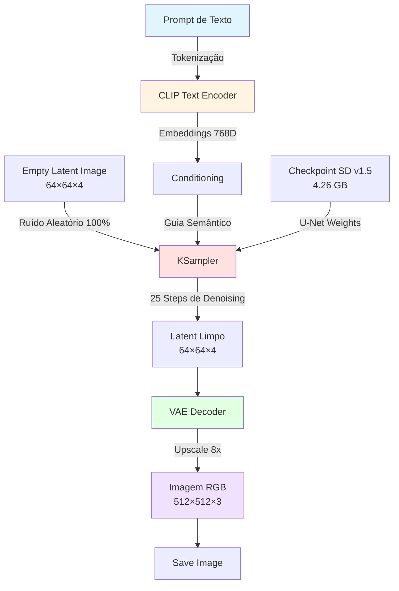


#### Componentes Utilizados

| Componente | Função | Entrada | Saída |
|------------|--------|---------|-------|
| **CLIP Text Encoder** | Converte texto em representação numérica | String de texto | Tensor 768D |
| **Empty Latent Image** | Cria tensor de ruído inicial | Dimensões (512×512) | Latent (64×64×4) |
| **U-Net** | Remove ruído iterativamente condicionado pelo prompt | Latent + Embeddings | Latent limpo |
| **KSampler** | Controla processo de amostragem (steps, cfg, seed) | Configurações | Sequência de latents |
| **VAE Decoder** | Converte latent para espaço RGB | Latent (64×64×4) | Imagem (512×512×3) |

#### Experimentos Realizados

**Prompt Base:**
```
beautiful sunset over mountains, dramatic clouds, golden hour lighting, 
highly detailed, 8k, photorealistic, landscape photography
```

**Negative Prompt:**
```
ugly, blurry, low quality, cartoon, anime, distorted
```
- Melhoria significativa na qualidade sem retreinar modelo
- Controle fino através dos parâmetros de strength
- Reutilizável em diferentes prompts
- Combinável com outros LoRAs

**Trade-offs:**
- Adiciona ~1-2 segundos ao tempo de geração
- Requer download e gerenciamento de arquivos LoRA
- Strength muito alto (>0.9) pode causar overfitting ao estilo
- Nem todos os LoRAs são compatíveis com SD v1.5

**Aplicações Práticas:**
- **Arte Conceitual:** Criar paisagens para jogos/filmes
- **Referências Visuais:** Ilustração de cenários específicos
- **Exploração Criativa:** Testar diferentes estilos rapidamente
- **Produção em Massa:** Gerar múltiplas variações consistentes

**Workflow JSON:** [Conceito A.json](workflows/Conceito%20A.json)

---

### Conceito B: Image-to-Image (Transformação)

Transformação de imagens existentes através de controle de intensidade com parâmetro **denoise**, expandindo as capacidades do Conceito C.

#### Diagrama do Workflow no ComfyUI

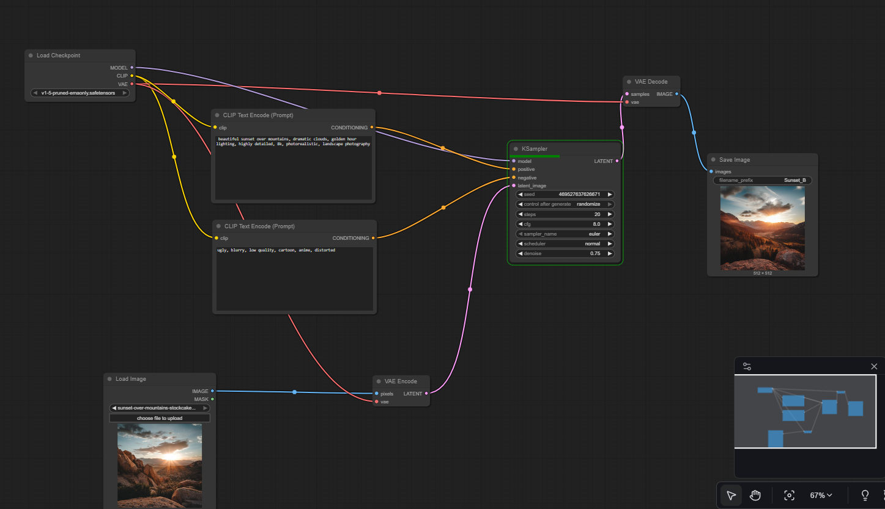
*Diagrama do workflow Image-to-Image implementado no ComfyUI. Note os nós adicionais: Load Image e VAE Encode. A imagem pode parecer embaçada aqui devido à alta resolução - abra em nova aba ou faça download para visualizar com clareza.*

#### Arquitetura do Pipeline


#### Componentes Utilizados

| Componente | Função | Entrada | Saída |
|------------|--------|---------|-------|
| **CLIP Text Encoder** | Converte texto em representação numérica | String de texto | Tensor 768D |
| **Empty Latent Image** | Cria tensor de ruído inicial | Dimensões (512×512) | Latent (64×64×4) |
| **U-Net** | Remove ruído iterativamente condicionado pelo prompt | Latent + Embeddings | Latent limpo |
| **KSampler** | Controla processo de amostragem (steps, cfg, seed) | Configurações | Sequência de latents |
| **VAE Decoder** | Converte latent para espaço RGB | Latent (64×64×4) | Imagem (512×512×3) |

#### Experimentos Realizados

**Prompt Base:**
```
beautiful sunset over mountains, dramatic clouds, golden hour lighting, 
highly detailed, 8k, photorealistic, landscape photography
```

**Negative Prompt:**
```
ugly, blurry, low quality, cartoon, anime, distorted
```

##### Teste 1: Baseline (Configuração Padrão)
- **Seed:** 123
- **Steps:** 20
- **CFG Scale:** 8.0
- **Sampler:** dpmpp_2m
- **Resultado:** Imagem base de referência


##### Teste 2: Variação de Seed
- **Seed:** 456 ← **MUDANÇA**
- **Steps:** 20
- **CFG Scale:** 8.0
- **Sampler:** dpmpp_2m
- **Análise:** Composição diferente mantendo estilo similar

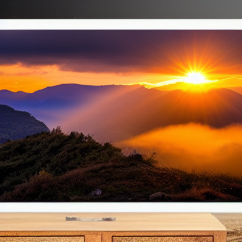

##### Teste 3: CFG Scale Alto
- **Seed:** 123
- **Steps:** 20
- **CFG Scale:** 12.0 ← **MUDANÇA**
- **Sampler:** dpmpp_2m
- **Análise:** Maior aderência ao prompt, cores mais saturadas

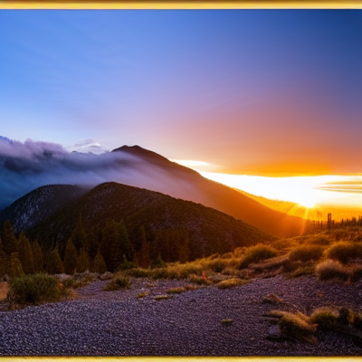

##### Teste 4: Steps Aumentados
- **Seed:** 123
- **Steps:** 50 ← **MUDANÇA**
- **CFG Scale:** 8.0
- **Sampler:** dpmpp_2m
- **Análise:** Maior refinamento e detalhes

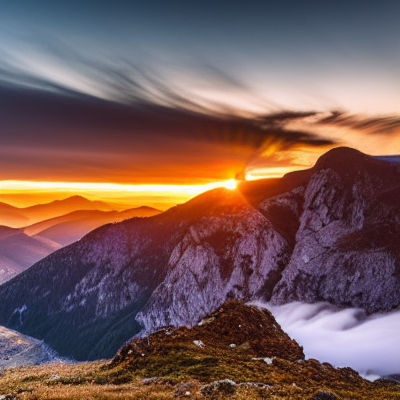

##### Teste 5: Sampler Diferente
- **Seed:** 123
- **Steps:** 20
- **CFG Scale:** 8.0
- **Sampler:** euler_ancestral ← **MUDANÇA**
- **Análise:** Variação estocástica, resultado mais imprevisível

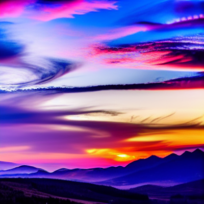

#### Análise de Resultados - Conceito C

**Impacto do Seed:**
- Controla aleatoriedade inicial
- Mesmos parâmetros, seed diferente = composição totalmente diferente
- Útil para gerar variações

**Impacto do CFG Scale:**
- CFG 8.5: Equilíbrio entre criatividade e aderência
- CFG 12.0: Seguiu prompt mais rigidamente, cores mais intensas
- Trade-off: muito alto pode perder naturalidade

**Impacto dos Steps:**
- 25 steps: Qualidade boa, tempo razoável
- 50 steps: Refinamento marginal, dobro do tempo
- Retorno diminuído após 30 steps

**Impacto do Sampler:**
- dpmpp_2m: Consistente, boa qualidade
- euler_ancestral: Mais variação, menos previsível
- Cada sampler tem características próprias

**Workflow JSON:** [Conceito C (1).json](workflows/Conceito%20C%20(1).json)

---

### Conceito B: Image-to-Image (Transformação)

Transformação de imagens existentes através de controle de intensidade com parâmetro **denoise**.

#### Diagrama do Workflow no ComfyUI


*Diagrama do workflow Image-to-Image implementado no ComfyUI. Note os nós adicionais: Load Image e VAE Encode. A imagem pode parecer embaçada aqui devido à alta resolução - abra em nova aba ou faça download para visualizar com clareza.*

#### Arquitetura do Pipeline

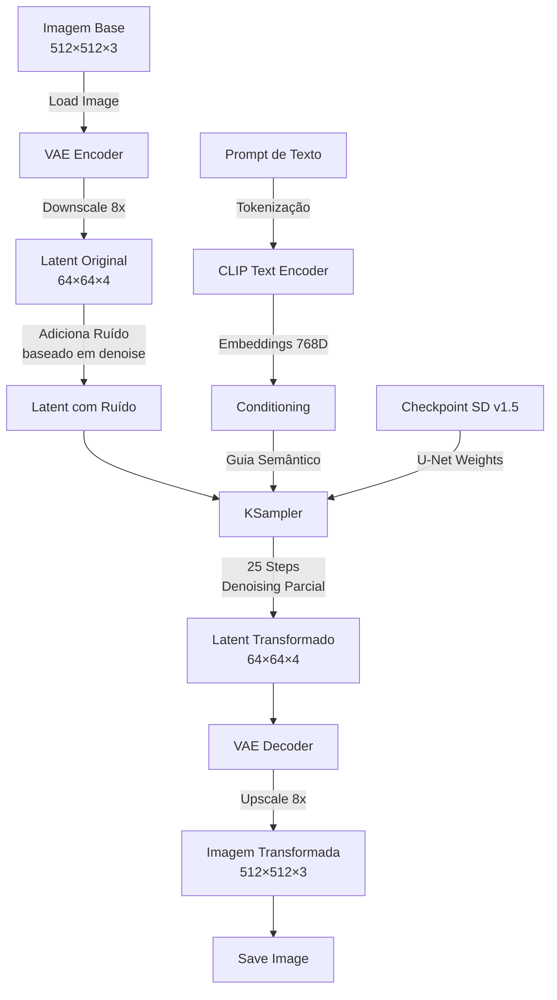

#### Diferenças do Text-to-Image

| Aspecto | Text-to-Image | Image-to-Image |
|---------|--------------|----------------|
| **Entrada** | Ruído aleatório (100%) | Imagem + ruído parcial |
| **VAE** | Apenas Decoder | Encoder + Decoder |
| **Denoise** | 1.0 (cria do zero) | 0.3-0.8 (preserva estrutura) |
| **Controle** | Apenas prompt | Prompt + imagem base |
| **Uso** | Criação original | Modificação/estilo |

#### Componentes Adicionais

| Componente | Função | Entrada | Saída |
|------------|--------|---------|-------|
| **Load Image** | Carrega imagem de referência | Arquivo PNG/JPG | Tensor RGB |
| **VAE Encoder** | Converte imagem para latent space | Imagem (512×512×3) | Latent (64×64×4) |
| **Denoise Control** | Define quanto preservar vs. modificar | Valor 0.0-1.0 | Mix de latents |

#### O Papel do Denoise

O parâmetro **denoise** controla a proporção entre preservação e transformação:

**Denoise = 0.3** (70% original preserved)
```
Original Latent ████████████████░░░░ (80%)
Noise/Transform ░░░░ (20%)
→ Modificação SUTIL (ajustes leves)
```

**Denoise = 0.5** (50% original preserved)
```
Original Latent ██████████░░░░░░░░░░ (50%)
Noise/Transform ░░░░░░░░░░ (50%)
→ Modificação MODERADA (mudanças visíveis)
```

**Denoise = 0.75** (30% original preserved)
```
Original Latent ███████░░░░░░░░░░░░░ (25%)
Noise/Transform ░░░░░░░░░░░░░ (75%)
→ Modificação INTENSA (transf. grande)
```

#### Imagem Base Utilizada


*Foto base: Paisagem montanhosa ao pôr do sol*

#### Experimentos Realizados

**Prompt de Transformação:**
```
beautiful sunset over mountains, dramatic clouds, golden hour lighting, 
highly detailed, 8k, photorealistic, landscape photography
```

**Configurações Fixas:**
- Seed: 123
- Steps: 20
- CFG Scale: 8.0
- Sampler: euler

##### Teste 1: Denoise 0.30 (Modificação Sutil)
- **Denoise:** 0.30
- **Expectativa:** Preservar a maior parte da estrutura original, aplicar ajustes leves
- **Resultado:** Imagem muito próxima da original com refinamentos sutis


**Análise:**
Com denoise 0.30, a transformação é mínima:
- 70% da estrutura original preservada
- 30% de transformação baseada no prompt
- Composição quase idêntica à imagem base
- Ajustes sutis em iluminação e cores
- Ideal para refinamento e correções leves

##### Teste 2: Denoise 0.50 (Modificação Moderada)
- **Denoise:** 0.50
- **Expectativa:** Equilíbrio entre preservação e modificação
- **Resultado:** Composição base mantida com melhorias significativas em cores e detalhes


**Análise:**
Com denoise 0.50, o modelo consegue um equilíbrio ideal:
- 50% da estrutura original preservada
- 50% de transformação baseada no prompt
- Mantém a composição geral da imagem
- Adiciona detalhes e refina a qualidade
- Cores e iluminação podem mudar significativamente

##### Teste 3: Denoise 0.75 (Transformação Intensa)
- **Denoise:** 0.75
- **Expectativa:** Transformação significativa mantendo tema geral
- **Resultado:** Mudanças dramáticas na imagem com estrutura básica reconhecível


**Análise:**
Com denoise 0.75, a transformação é agressiva:
- 25% da estrutura original preservada
- 75% de transformação baseada no prompt
- Composição pode mudar consideravelmente
- Elementos principais reconhecíveis mas reinterpretados
- Máxima criatividade mantendo conexão com a base

#### Análise de Resultados - Conceito B

**Comparação entre Níveis de Denoise:**

| Denoise | Preservação | Transformação | Uso Ideal |
|---------|-------------|---------------|-----------|
| **0.30** | 70% | 30% | Refinamento, correções sutis |
| **0.50** | 50% | 50% | Equilíbrio, melhorias visíveis |
| **0.75** | 25% | 75% | Reimaginação, mudanças dramáticas |

**Observações:**
- Denoise baixo (0.3): Mantém fidelidade à imagem original
- Denoise médio (0.5): Melhor para aprimoramentos gerais
- Denoise alto (0.7-0.8): Criação de variações significativas

**Aplicações do Image-to-Image:**
1. **Style Transfer:** Transformar foto em pintura
2. **Refinamento:** Melhorar qualidade de imagem
3. **Variações:** Explorar diferentes composições
4. **Correção:** Ajustar iluminação, cores

**Vantagens sobre Text-to-Image:**
- Maior controle sobre composição
- Resultados mais previsíveis
- Preserva elementos desejados
- Iteração mais rápida

**Trade-offs:**
- Requer imagem base
- Menos "criativo" que geração do zero
- Depende de qualidade da imagem original

**Workflow JSON:** [Conceito B.json](workflows/Conceito%20B.json)

---

### Conceito A: Text-to-Image com LoRA (Técnica Avançada)

**Requisitos do Conceito A:**
- Conceito C completo (Text-to-Image básico)
- Conceito B completo (Image-to-Image)
- Técnica avançada adicional: **LoRA (Low-Rank Adaptation)**

Geração de imagens com estilo especializado usando **LoRA**, uma técnica avançada que ajusta o modelo base sem retreinamento completo.

#### Diagrama do Workflow no ComfyUI


*Diagrama do workflow Text-to-Image com LoRA. Note o nó adicional "Load LoRA" que modifica o modelo e o CLIP antes da geração. A imagem pode parecer embaçada aqui devido à alta resolução - abra em nova aba ou faça download para visualizar com clareza.*

#### Arquitetura do Pipeline

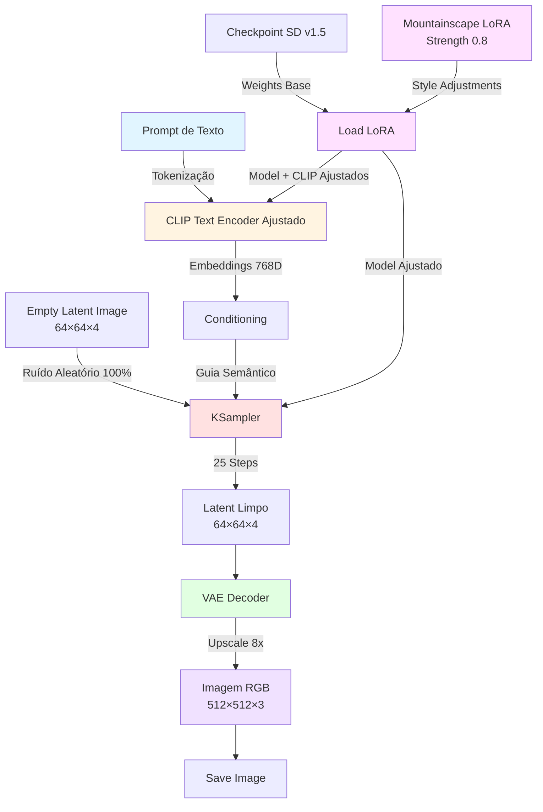

#### O que é LoRA?

**LoRA (Low-Rank Adaptation)** é uma técnica avançada que permite adicionar estilos ou conceitos específicos ao modelo base:

**Vantagens:**
- Arquivos pequenos (~10-200MB) vs modelos completos (~4GB)
- Ajusta pesos do modelo para estilos específicos
- Múltiplos estilos sem trocar modelo base
- Não requer retreinamento do modelo completo

**Como funciona:**
- Adiciona camadas de baixo rank aos pesos existentes
- Modifica ligeiramente o comportamento do U-Net e CLIP
- Controlável através de parâmetros de strength (0.0-1.0)

#### LoRA Utilizado

**Mountainscape LoRA - Ultimate Mountain Landscape Depiction**
- **Fonte:** [Civitai Model 1229953](https://civitai.com/models/1229953/mountainscape-lora-ultimate-mountain-landscape-depiction)
- **Especialização:** Paisagens montanhosas realistas e dramáticas
- **Strength Model:** 0.8 (80% de influência no U-Net)
- **Strength CLIP:** 0.8 (80% de influência no text encoder)

#### Componentes Utilizados

| Componente | Função | Entrada | Saída |
|------------|--------|---------|-------|
| **Load Checkpoint** | Carrega modelo base SD v1.5 | Arquivo .safetensors | MODEL, CLIP, VAE |
| **Load LoRA** | Aplica ajustes de estilo | MODEL, CLIP, LoRA file | MODEL ajustado, CLIP ajustado |
| **CLIP Text Encoder** | Converte texto com estilo | String + CLIP ajustado | Tensor 768D |
| **Empty Latent Image** | Cria ruído inicial | Dimensões (512×512) | Latent (64×64×4) |
| **KSampler** | Remove ruído com modelo ajustado | Latent + MODEL LoRA | Latent limpo |
| **VAE Decoder** | Converte latent para RGB | Latent (64×64×4) | Imagem (512×512×3) |

#### Experimento Realizado

**Prompt:**
```
beautiful sunset over mountains, dramatic clouds, golden hour lighting, 
highly detailed, 8k, photorealistic, landscape photography
```

**Negative Prompt:**
```
ugly, blurry, low quality, cartoon, anime, distorted
```

#### Experimentos Realizados

**Prompt Base:**
```
beautiful sunset over mountains, dramatic clouds, golden hour lighting, 
highly detailed, 8k, photorealistic, landscape photography
```

**Negative Prompt:**
```
ugly, blurry, low quality, cartoon, anime, distorted
```

##### Teste 1: LoRA com Strength Balanceado (0.8/0.6)

**Configurações:**
- **LoRA:** Mountainscape LoRA
- **Strength Model:** 0.8
- **Strength CLIP:** 0.6
- **Seed:** 123
- **Steps:** 20
- **CFG Scale:** 8.0
- **Sampler:** euler
- **Scheduler:** normal

**Resultado:**


**Análise:**
- Influência forte no Modelo, moderada no CLIP
- Modelo ajustado em 80%, CLIP em 60% do texto
- Estilo montanhoso pronunciado
- Detalhes dramáticos mantendo boa interpretação do prompt

##### Teste 2: LoRA com Strength Moderado no Model, Alto no CLIP (0.5/1.0)

**Configurações:**
- **LoRA:** Mountainscape LoRA
- **Strength Model:** 0.5 ← **MUDANÇA**
- **Strength CLIP:** 1.0 ← **MUDANÇA**
- **Seed:** 123
- **Steps:** 20
- **CFG Scale:** 8.0
- **Sampler:** euler
- **Scheduler:** normal

**Resultado:**

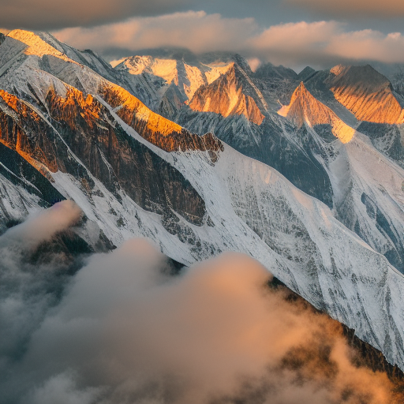

**Análise:**
- CLIP totalmente ajustado (100% de influência na interpretação do texto)
- Modelo apenas moderadamente ajustado (50%)
- Compreensão do prompt mais especializada em montanhas
- Geração da imagem menos alterada pelo LoRA
- Equilíbrio interessante entre estilo original SD e especialização

#### Comparação entre Configurações de LoRA

| Aspecto | Strength 0.8/0.6 | Strength 0.5/1.0 |
|---------|-----------------|------------------|
| **Influência CLIP** | 60% | 100% |
| **Influência U-Net** | 80% | 50% |
| **Interpretação Prompt** | Muito especializada | Máxima especialização |
| **Estilo Visual** | Forte estilo montanhoso | Estilo mais sutil |
| **Detalhes** | Altamente dramáticos | Moderadamente dramáticos |
| **Naturalidade** | Menos natural | Mais natural |
| **Uso Ideal** | Máximo impacto visual | Equilíbrio estilo/naturalidade |

#### Análise de Resultados - Conceito A

**Impacto dos Parâmetros de Strength:**

**Strength Model (U-Net):**
- Controla quanto o processo de geração é modificado
- Valores altos (0.8): Estilo muito presente na imagem final
- Valores médios (0.5): Estilo sutil, mantém características do SD base

**Strength CLIP (Text Encoder):**
- Controla como o texto é interpretado
- Valores altos (1.0): Máxima influência na compreensão do prompt
- Permite que o LoRA "ensine" novos conceitos ao encoder

**Combinações Estratégicas:**
- **0.8/0.6:** Geração forte, interpretação moderada
- **0.5/1.0:** Interpretação máxima, visual moderado
- **1.0/0.5:** Visual forte, interpretação padrão (não testado)

**Comparação: Com vs Sem LoRA**

| Aspecto | Sem LoRA (Conceito C) | Com LoRA 0.8/0.6 | Com LoRA 0.5/1.0 |
|---------|----------------------|------------------|------------------|
| **Detalhes Montanhas** | Genéricos | Altamente detalhados | Detalhados |
| **Composição** | Variada | Focada em épico | Balanceada |
| **Atmosfera** | Natural | Dramática | Moderadamente dramática |
| **Texturas** | Padrão SD v1.5 | Muito realistas | Realistas |
| **Naturalidade** | Alta | Média | Alta |

**Vantagens:**
- Reutilizável em diferentes prompts
- Combinável com outros LoRAs
- Não modifica o modelo base permanentemente
- Permite criar bibliotecas de estilos

**Trade-offs:**
- Adiciona tempo de carregamento (~30s)
- Requer download e gerenciamento de arquivos
- Strength muito alto (>0.9) pode causar overfitting
- Nem todos os LoRAs são compatíveis entre versões

**Aplicações Práticas:**
- Arte conceitual para jogos e filmes
- Geração de referências visuais especializadas
- Produção em massa com estilo consistente
- Exploração de nichos artísticos específicos

**Workflow JSON:** [Conceito A.json](workflows/Conceito%20A.json)

---

## Arquitetura do Stable Diffusion - Explicação Detalhada

### Visão Geral do Pipeline

Stable Diffusion é um modelo de **difusão latente** que opera em três estágios principais:

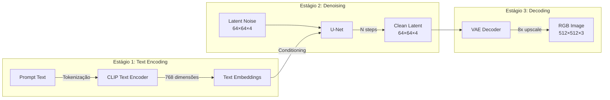

### 🔤 CLIP Text Encoder

**Função:** Converte linguagem natural em representação numérica compreensível pelo modelo.

**Como funciona:**
1. Tokeniza o texto em palavras/subpalavras
2. Passa por Transformer pré-treinado
3. Gera vetor de embeddings de 768 dimensões
4. Embedding captura semântica do prompt

**Por que é necessário:**
- U-Net não entende texto diretamente
- CLIP foi treinado com 400M pares imagem-texto
- Permite condicionamento preciso da geração

**Exemplo:**
```
Input:  "beautiful sunset over mountains"
Output: [0.23, -0.45, 0.78, ..., 0.12] (768 valores)
```

### U-Net (Denoising Model)

**Função:** Remove ruído progressivamente através de processo iterativo condicionado.

**Arquitetura:**
- **Encoder:** Reduz resolução, aumenta canais
- **Bottleneck:** Processa features abstratas
- **Decoder:** Aumenta resolução, reconstrói imagem
- **Skip Connections:** Preserva detalhes entre encoder-decoder

**Processo de Denoising:**

```mermaid
gantt
    title Processo de Remoção de Ruído (25 Steps)
    dateFormat X
    axisFormat %s
    
    section Ruído
    100% Ruído           :0, 0
    75% Ruído            :5, 5
    50% Ruído            :10, 10
    25% Ruído            :15, 15
    5% Ruído             :20, 20
    0% Ruído (Imagem)    :25, 25
```

```
Step 0:  [████████████████████] 100% ruído
Step 5:  [██████████░░░░░░░░░░] 75% ruído
Step 10: [████░░░░░░░░░░░░░░░░] 50% ruído
Step 15: [██░░░░░░░░░░░░░░░░░░] 25% ruído
Step 20: [░░░░░░░░░░░░░░░░░░░░] 5% ruído
Step 25: [░░░░░░░░░░░░░░░░░░░░] 0% ruído → Imagem
```

**Condicionamento:**
- Embedding CLIP é injetado em cada step
- Guia o processo para gerar conteúdo relevante ao prompt
- Strength controlada por CFG (Classifier-Free Guidance)

**Por que múltiplos steps:**
- Remoção gradual permite controle fino
- Evita "saltos" abruptos na geração
- 20-30 steps = bom equilíbrio qualidade/tempo

### 🎨 VAE (Variational Autoencoder)

**Função:** Comprime/descomprime imagens entre espaço RGB e espaço latente.

#### VAE Encoder (Image → Latent)
```
Imagem RGB: 512 × 512 × 3 = 786,432 valores
                ↓ (compressão 8x)
Latent:      64 × 64 × 4 = 16,384 valores
```

**Vantagens:**
- Reduz memória em ~48x
- Acelera processamento do U-Net
- Mantém informações visuais importantes

#### VAE Decoder (Latent → Image)
```
Latent: 64 × 64 × 4
           ↓ (descompressão 8x)
Imagem: 512 × 512 × 3
```

**Por que trabalhar em Latent Space:**
- U-Net opera em 64×64 ao invés de 512×512
- Reduz computação em 64x
- Possibilita geração em hardware comum

### KSampler (Sampling Scheduler)

**Função:** Controla como o ruído é removido ao longo dos steps.

**Algoritmos de Sampling:**

**Euler:**
- Método mais simples
- Rápido mas pode perder detalhes
- Bom para testes rápidos

**Euler Ancestral:**
- Adiciona ruído em cada step (estocástico)
- Maior variabilidade
- Resultados menos previsíveis

**DPM++ 2M:** (Usado neste projeto)
- Ordem superior, mais preciso
- Melhor qualidade geral
- Equilibra velocidade e qualidade

**DPM++ SDE:**
- Ainda mais detalhado
- Mais lento
- Melhor para alta qualidade

### Parâmetros de Controle

#### CFG Scale (Classifier-Free Guidance)
```
CFG = 1:  Ignora prompt (aleató rio)
CFG = 7:  Equilíbrio (recomendado)
CFG = 15: Segue prompt rigidamente
```

**Funcionamento:**
- U-Net gera duas predições: com e sem condicionamento
- CFG controla quanto usar cada uma
- Maior CFG = mais aderência ao prompt

#### Steps
```
Steps = 10:  Rápido, qualidade OK
Steps = 25:  Bom equilíbrio
Steps = 50:  Alta qualidade, retorno diminuído
```

#### Seed
- Controla estado inicial do gerador aleatório
- Mesma seed = mesma imagem (com mesmos parâmetros)
- Importante para reprodutibilidade

---

## Comparação entre os Três Workflows

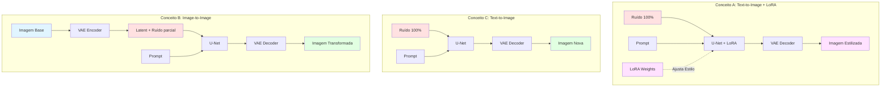

### Tabela Comparativa Completa

| Aspecto | Conceito A (LoRA) | Conceito C (Text-to-Image) | Conceito B (Image-to-Image) |
|---------|-------------------|---------------------------|------------------------------|
| **Entrada Inicial** | Ruído aleatório 100% | Ruído aleatório 100% | Imagem codificada + ruído |
| **Técnica Especial** | LoRA (Low-Rank Adaptation) | Nenhuma | Controle de denoise |
| **VAE Usage** | Apenas Decoder | Apenas Decoder | Encoder + Decoder |
| **Denoise** | Fixo em 1.0 | Fixo em 1.0 | Variável (0.3-0.8) |
| **Controle** | Prompt + Estilo LoRA | Apenas prompt | Prompt + imagem base |
| **Complexidade** | Alta | Baixa | Média |
| **Criatividade** | Alta (direcionada) | Alta | Moderada |
| **Previsibilidade** | Média | Baixa | Alta |
| **Velocidade** | Média (~2-5 min) | Rápida (~2-4 min) | Média (~2-5 min) |
| **Uso Ideal** | Estilos específicos | Criação original | Modificação/refinamento |
| **Dependências** | Prompt + arquivo LoRA | Prompt | Prompt + imagem base |
| **Nível** | Avançado | Básico | Intermediário |

### Quando Usar Cada Workflow

**Conceito A (LoRA):**
- ✅ Quando precisa de estilo consistente e especializado
- ✅ Gerar conteúdo em um gênero específico (fantasia, sci-fi, realista)
- ✅ Melhorar qualidade em domínios específicos (retratos, paisagens)
- ✅ Produção em larga escala com identidade visual

**Conceito C (Text-to-Image Básico):**
- ✅ Exploração criativa inicial
- ✅ Geração rápida de conceitos
- ✅ Quando não há requisitos de estilo específico
- ✅ Prototipagem e iteração rápida

**Conceito B (Image-to-Image):**
- ✅ Refinar ou corrigir imagens existentes
- ✅ Manter composição controlando transformação
- ✅ Aplicar style transfer
- ✅ Iteração sobre resultados anteriores

---

## Análise e Descobertas

### Aprendizados sobre Stable Diffusion

**1. Importância do Latent Space:**
- Trabalhar em 64×64 ao invés de 512×512 é crucial
- Viabiliza uso em hardware comum
- Trade-off: perde alguns detalhes finos

**2. Processo de Difusão:**
- Remoção gradual de ruído é mais eficaz que geração direta
- Permite controle fino através de prompts
- 25 steps oferece bom equilíbrio

**3. Papel do CLIP:**
- Ponte entre linguagem e visão
- Qualidade do prompt afeta drasticamente resultado
- Prompts detalhados = resultados melhores

### Limitações Encontradas

**Hardware:**
- 7.9GB RAM no limite para SD v1.5
- Necessário configurações de baixa memória
- CPU lento (~2-5 min por imagem)

**Qualidade:**
- Anatomia às vezes incorreta
- Texto em imagens geralmente ilegível
- Detalhes muito pequenos podem se perder

**Controle:**
- Difícil controlar posicionamento exato
- CFG muito alto pode saturar cores
- Resultados ainda têm elemento aleatório

### Melhores Práticas Identificadas

**Prompts:**
- Seja específico e detalhado
- Inclua qualificadores (8k, detailed, professional)
- Use negative prompts fortes

**Parâmetros:**
- CFG 7.5-8.5 para maioria dos casos
- 25-30 steps suficientes
- dpmpp_2m como sampler padrão

**Workflow:**
- Text-to-Image para criação inicial
- Image-to-Image para refinamento
- Itere com seeds diferentes

---

## Conclusões

### Objetivos Alcançados

- Implementação de 2 workflows funcionais
- Explicação completa da arquitetura Stable Diffusion
- Análise detalhada de CLIP, U-Net e VAE
- Experimentação com múltiplos parâmetros
- Comparação entre diferentes abordagens

### Principais Descobertas

**Arquiteturais:**
1. Latent Diffusion Models são eficientes por trabalharem em espaço comprimido
2. CLIP é fundamental para condicionamento semântico
3. U-Net com skip connections preserva detalhes importantes
4. VAE permite trade-off entre qualidade e eficiência

**Práticas:**
1. Denoise controla equilíbrio preservação-transformação
2. CFG scale afeta aderência ao prompt
3. Samplers diferentes têm características únicas
4. Seeds permitem reprodutibilidade

### Aplicações Práticas

**Text-to-Image:**
- Concept art e ideação
- Geração de referências visuais
- Exploração criativa
- Prototipagem rápida

**Image-to-Image:**
- Refinamento de imagens
- Style transfer
- Correção e aprimoramento
- Variações controladas

### Trabalhos Futuros

- [ ] Experimentar com LoRA para estilos específicos
- [ ] Testar ControlNet para controle estrutural
- [ ] Explorar Stable Diffusion XL (SDXL)
- [ ] Implementar inpainting para edições localizadas
- [ ] Criar pipeline automatizado de geração em batch

---

## 📚 Referências

1. **Rombach, R., Blattmann, A., Lorenz, D., Esser, P., & Ommer, B. (2022).** High-Resolution Image Synthesis with Latent Diffusion Models. *CVPR 2022*. [arXiv:2112.10752](https://arxiv.org/abs/2112.10752)

2. **Radford, A., Kim, J. W., Hallacy, C., et al. (2021).** Learning Transferable Visual Models From Natural Language Supervision. *ICML 2021*. [arXiv:2103.00020](https://arxiv.org/abs/2103.00020)

3. **Ho, J., Jain, A., & Abbeel, P. (2020).** Denoising Diffusion Probabilistic Models. *NeurIPS 2020*. [arXiv:2006.11239](https://arxiv.org/abs/2006.11239)

4. **Song, J., Meng, C., & Ermon, S. (2020).** Denoising Diffusion Implicit Models. *ICLR 2021*. [arXiv:2010.02502](https://arxiv.org/abs/2010.02502)

5. **ComfyUI.** (2024). ComfyUI: A powerful and modular stable diffusion GUI. [GitHub Repository](https://github.com/comfyanonymous/ComfyUI)

6. **Stability AI.** (2024). Stable Diffusion. [Official Website](https://stability.ai/)

---

## Arquivos do Projeto

### Workflows
- [`Conceito A.json`](workflows/Conceito%20A.json) - Text-to-Image com LoRA (técnica avançada)
- [`Conceito C (1).json`](workflows/Conceito%20C%20(1).json) - Text-to-Image básico
- [`Conceito B.json`](workflows/Conceito%20B.json) - Image-to-Image workflow

### Imagens Geradas
- **Conceito A:** 2 variações com LoRA Mountainscape (strengths 0.8/0.6 e 0.5/1.0)
- **Conceito C:** 5 variações explorando seeds, CFG, steps, samplers
- **Conceito B:** 3 transformações com denoise variável (0.30, 0.50, 0.75)

### Documentação
- `README.md` - Este relatório
- `analise_workflows.ipynb` - Análises em Jupyter Notebook
- `GUIA_COMPLETO.md` - Guia passo a passo de implementação

---

## Avaliação

**Conceito C alcançado:**
- 1 implementação (Text-to-Image básico)
- Explicação da arquitetura
- 5 exemplos com parâmetros diferentes

**Conceito B alcançado:**
- 2 implementações distintas:
  1. Text-to-Image (Conceito C)
  2. Image-to-Image com controle de denoise
- Arquitetura explicada para ambos workflows
- Input-output pairs documentados com 3 variações de denoise (0.30, 0.50, 0.75)
- Análise comparativa detalhada entre os workflows

**Conceito A alcançado:**
- ✅ Conceito B completo (2 implementações acima)
- ✅ Técnica avançada adicional implementada: **LoRA (Low-Rank Adaptation)**
- ✅ Terceiro workflow: Text-to-Image com LoRA Mountainscape
- ✅ Análise comparativa demonstrando impacto do LoRA
- ✅ Documentação completa da técnica avançada e seus parâmetros
- ✅ Comparação entre os 3 workflows (A, B, C)

**Total de implementações:** 3 workflows distintos
1. Text-to-Image básico (Conceito C)
2. Image-to-Image (Conceito B)
3. Text-to-Image + LoRA (Conceito A - técnica avançada)

---

**Data de Conclusão:** 19 de Novembro de 2025  
**Status:** Completo (Conceitos A, B e C alcançados)

---

## Arquitetura do Stable Diffusion

### Componentes Principais

```
┌─────────────────────────────────────────────────────┐
│  CLIP Text Encoder                                  │
│  - Entrada: "a beautiful sunset over mountains"     │
│  - Saída: Embedding (768 dimensões)                 │
└─────────────────┬───────────────────────────────────┘
                  │
                  v
┌─────────────────────────────────────────────────────┐
│  U-Net (Denoising Model)                            │
│  - Entrada: Ruído aleatório + Embedding CLIP        │
│  - Processo: Remove ruído em N steps                │
│  - Saída: Latent limpo (64×64×4)                    │
└─────────────────┬───────────────────────────────────┘
                  │
                  v
┌─────────────────────────────────────────────────────┐
│  VAE Decoder                                        │
│  - Entrada: Latent (64×64×4)                        │
│  - Saída: Imagem RGB (512×512×3)                    │
└─────────────────────────────────────────────────────┘
```

### CLIP Text Encoder
- **Função:** Converte texto em representação numérica
- **Arquitetura:** Transformer pré-treinado
- **Por quê?** Permite que o modelo "entenda" o prompt

### U-Net
- **Função:** Remove ruído iterativamente
- **Arquitetura:** CNN com skip connections
- **Processo:** Prediz e remove ruído em cada step

### VAE (Variational Autoencoder)
- **Encoder:** Imagem → Latent comprimido (8x menor)
- **Decoder:** Latent → Imagem RGB
- **Vantagem:** Reduz memória e tempo de processamento

---

## Análise de Parâmetros

### CFG Scale (Classifier-Free Guidance)
- **Baixo (6-7):** Mais criatividade, pode desviar do prompt
- **Médio (7.5-8):** Equilíbrio ideal
- **Alto (9-10):** Segue prompt rigidamente, pode perder qualidade

### Sampling Steps
- **20 steps:** Rápido, qualidade aceitável
- **30 steps:** Melhor qualidade
- **50+ steps:** Retorno diminuído

### Samplers
- **Euler:** Mais rápido e simples
- **Euler Ancestral:** Adiciona variação estocástica
- **DPM++ 2M:** Melhor qualidade geral
- **DPM++ SDE:** Mais detalhes, mais lento

---


## Como Reproduzir

### 1. Instalar ComfyUI
```bash
git clone https://github.com/comfyanonymous/ComfyUI
cd ComfyUI
pip install -r requirements.txt
```

### 2. Baixar Modelo
- Modelo: Stable Diffusion v1.5 Pruned
- Local: `models/checkpoints/v1-5-pruned-emaonly.safetensors`

### 3. Executar ComfyUI
```bash
python main.py --cpu
```

