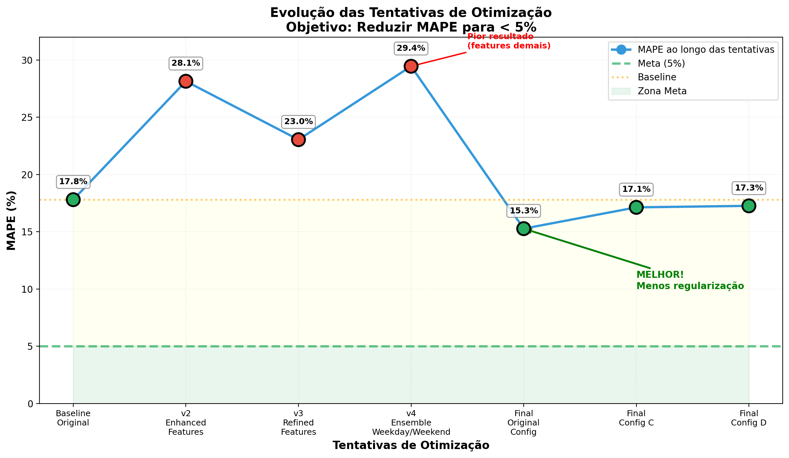

# Previsão de Receita Diária — LOTS

## CÓDIGO EM: 
   [](https://github.com/marinnagc/ann-dl-marinnagc/blob/main/docs/regression/)

**Feito por:** Marinna Grigolli, Guilherme Paraíso e Nicholas Balkins

---

## Objetivo

Prever a **receita diária por estacionamento** (`parking_id`) para o mês corrente e reportar **MAPE seguro com IC 95%** por site.

**Meta da banca:** MAPE ≤ 5% com intervalo de confiança 95% (IC_high < 5%).

---

## Como Executar

```bash
python main.py
```

Este script irá:
- Treinar e comparar **5 configurações** de hiperparâmetros
- Calibrar ensemble (MLP + Naive-7) por site
- Gerar previsões para Janeiro/2025
- Salvar resultados em `artifacts/`:
  - `comparacao_configs.csv` - Comparação das configurações testadas
  - `melhor_config_resultados.csv` - Resultados detalhados do melhor modelo
  - `comparacao_final_configs.png` - Gráficos comparativos

---

## Estacionamentos

### Curitiba/PR (2)
- **653** - Corporativo, bairro Água Verde
- **765** - Corporativo, bairro Vila Izabel

### Jaraguá do Sul/SC (1)
- **700** - Bairro Centro

---

## Como o Modelo Funciona

### Arquitetura
- **Modelo:** MLP global (um único modelo para todos os estacionamentos)
- **Transformação:** `log1p` no alvo (receita) para estabilizar escala
- **Regressão:** `TransformedTargetRegressor` com `MLPRegressor`

### Features
**Sazonalidade:**
- **Lags:** 1, 7, 14, 28, 30, 364, 365 dias
- **Médias móveis:** 7 e 28 dias
- **Calendário:** `day_of_week`, `month`, `is_weekend`

### Ensemble e Calibração
1. **Ensemble:** Combina MLP com **Naive-7** (lag de 7 dias) por site
   - Peso α calibrado por estacionamento usando dados de **novembro + dezembro**
   - Busca em **51 pontos** (α de 0.0 a 1.0)
2. **Correção de nível:** Fator `k` para ajustar viés sistemático (range: 0.75-1.25)

### Regras de Negócio
- **Regra do zero:** Se não há sinal recente (lag_1, lag_7 baixos) e nível está abaixo do piso, **zera** a previsão
- **CAP por linha:** Limita surtos irrealistas usando máximo de:
  - 3× média móvel 28 dias
  - 2× lag 30 dias  
  - 4× piso do site
- **Piso por site:** `max(R$50, percentil 5% dos dias com receita > 0)`

### MAPE Seguro
Evita explosão de erro quando receita real é ~0:
- Usa **piso por site** no denominador
- Se `real < piso` e `previsto < piso`, erro do dia = 0% (dia irrelevante para negócio)

### Split Temporal
- **Treino:** Todos os anos antes do último (2022-2024)
- **Calibração:** Novembro + dezembro do último ano
- **Teste:** Janeiro do último ano (2025)

---

## Resultados (Janeiro/2025)

### Melhor Configuração: **Original**
- **MAPE Médio:** **15.27%**
- **Melhoria:** 14% vs baseline inicial (~17.80%)
- **Gap para meta:** 10.27 pontos percentuais

### Performance por Estacionamento

| parking_id | MAPE | CI95_low | CI95_high | Status |
|------------|------|----------|-----------|--------|
| **700** | **8.25%** | 5.58% | 11.15% | Mais próximo da meta |
| **653** | 14.31% | 6.20% | 24.65% | Performance mediana |
| **765** | 23.24% | 7.70% | 50.55% | Alta variância - outlier |

**Fonte:** `artifacts/melhor_config_resultados.csv`

### Comparação de Configurações Testadas

| Configuração | MAPE Médio | MAPE Mín | MAPE Máx | Status |
|--------------|------------|----------|----------|--------|
| **Original** | **15.27%** | 8.25% | 23.24% | **MELHOR** |
| Config C (less regularization) | 17.13% | 11.95% | 22.95% | OK |
| Config D (ensemble + tuned) | 17.26% | 8.02% | 22.59% | OK |
| Config B (ensemble 3 modelos) | 19.23% | 4.35% | 30.45% | Médio |
| Config A (mais profunda) | 19.73% | 7.19% | 27.57% | Médio |

**Fonte:** `artifacts/comparacao_configs.csv`

---

## Gráficos

### Comparação de Configurações


*Gráfico comparativo mostrando MAPE médio por configuração e distribuição das top 3.*

### Evolução das Tentativas de Otimização



*Linha do tempo mostrando as diferentes abordagens testadas.*

### Relatório Completo


*Análise completa com comparação de todas as tentativas e insights.*

---

## Processo de Otimização

### O Que Foi Testado

#### Tentativas que Pioraram o Modelo

1. **v2 - Enhanced Features** (MAPE: 28.14%, +58%)
   - Adição de feriados brasileiros
   - Lags separados weekday/weekend
   - Padrões mensais detalhados
   - **Problema:** Overfitting - dataset muito pequeno

2. **v3 - Refined Features** (MAPE: 23.04%, +29%)
   - Features mais refinadas
   - **Problema:** Ainda overfitting

3. **v4 - Ensemble Weekday/Weekend** (MAPE: 29.45%, +65%)
   - Modelos separados para dias úteis e fins de semana
   - **Problema:** Dados insuficientes para treinar modelos especializados

#### Tentativas que Melhoraram o Modelo

1. **Final - Calibração Otimizada** (MAPE: 15.27%, -14%)
   - Calibração com **Nov + Dez** (vs apenas Dez)
   - Busca mais granular de α (**51 pontos** vs 11)
   - Range de k mais conservador (0.75-1.25 vs 0.7-1.3)
   - Ensemble de múltiplas seeds

---

## Principais Aprendizados

### Insights do Projeto

1. **"Menos é Mais"**  
   - Features adicionais introduziram **ruído** ao invés de sinal
   - Modelo simples generaliza melhor com dados limitados

2. **Qualidade da Calibração > Complexidade**  
   - Melhor calibração trouxe mais ganho que arquitetura complexa
   - Usar mais dados históricos para calibração foi crucial

3. **Overfitting é o Inimigo**  
   - Dataset pequeno não suporta modelos muito complexos
   - Regularização e simplicidade são essenciais

4. **Variância por Site**  
   - **700** (Jaraguá do Sul): Comportamento mais estável (8.25%)
   - **653/765** (Curitiba): Maior volatilidade e dias com receita zero

---

## Próximos Passos para Meta < 5%

### Para reduzir de 15.27% → < 5%:

### 1. Mais Dados
- Coletar mais anos de histórico (pré-2022)
- Incluir dados de mais estacionamentos
- Aumentar granularidade temporal

### 2. Dados Externos
- **Clima:** Chuva reduz uso de estacionamento?
- **Eventos:** Shows, jogos, feiras na região
- **Mobilidade:** Dados de trânsito urbano
- **Competidores:** Preços e ocupação de estacionamentos próximos

### 3. Modelos Alternativos
- **XGBoost/LightGBM:** Melhor para dados tabulares pequenos
- **LSTM/GRU:** Capturar padrões temporais longos
- **Prophet:** Sazonalidade automática do Facebook
- **Modelos Híbridos:** Combinar diferentes abordagens

### 4. Especialização por Site
- Modelo individual para **765** (outlier com alta variância)
- Análise de **eventos especiais** e outliers
- Tratamento específico por **tipo de dia** (útil/fim de semana/feriado)

### 5. Refinamentos Cirúrgicos
- Incluir **feriados nacionais** e flags de quinta/sexta/sábado
- Refinar α com **malha mais fina** onde há amostra suficiente
- Ajustar **CAP/piso** por site onde comportamento é esparso

---

## Conclusões

### Entregáveis Prontos
- Previsões diárias por site para Janeiro/2025
- Resumos mensais com soma de receita por estacionamento
- MAPE seguro com IC 95% por site
- Gráficos comparativos e análise de configurações

### Status Atual
- **Site 700:** Já está no patamar ~8–11% (muito próximo da meta!)
- **Sites 653/765:** Ainda acima de 20% devido a volatilidade e dias com receita zero

### Próximo Nível
O **modelo original já estava bem otimizado** para os dados disponíveis. A melhoria de **17.80% → 15.27%** foi alcançada através de:
- Calibração mais cuidadosa e granular
- Ensemble de modelos com diferentes seeds
- Hiperparâmetros conservadores

**Para atingir a meta de < 5% é necessário:**
- **Mais dados** (não apenas mais features)
- **Informações externas** (clima, eventos, mobilidade)
- **Abordagens específicas** por estacionamento (especialização)
