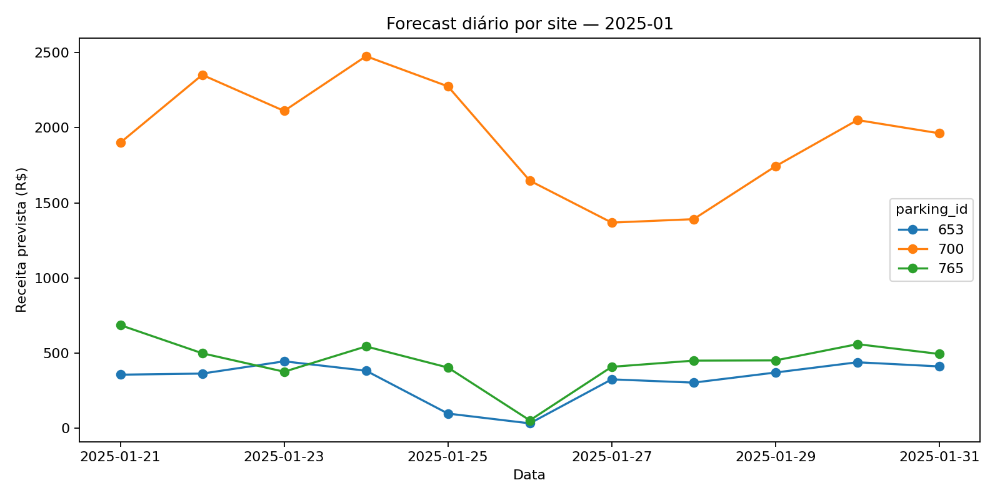

# Previsão de Receita Diária — LOTS 
Feito por: Marinna Grigolli, Guilherme Paraíso e Nicholas Balkins

## Objetivo

Prever a **receita diária** por estacionamento (*parking_id*) para o mês corrente, e reportar **MAPE** com **IC 95%** por site.

## Como o modelo funciona 

* **Modelo:** MLP global (um só modelo para todos os estacionamentos) com `log1p` no alvo.
* **Sazonalidade:** lags `1, 7, 14, 28, 30, 364, 365` + médias móveis `7/28` + `dow`, `month`, `is_weekend`.
* **Ensemble:** combina MLP com **Naive-7** por site (peso α calibrado em **dezembro do ano anterior**) e corrige nível com fator **k**.
* **Regras de negócio:**

  1. **Regra do zero** (se não há sinal recente e o nível está baixo, zera a previsão),
  2. **CAP por linha** (limita surtos),
  3. **MAPE seguro** (usa **piso por site** para não explodir erro quando o real é ~0).
* **Split temporal:** treino = todos os anos **antes** do último; teste = **último ano** (jan/2025 na avaliação abaixo).

---

    Curitiba/PR (2)
        653 - Corporativo, bairro Água Verde
        765 - Corporativo, bairro Vila Izabel
    Jaraguá do Sul/SC (1)
        700 - bairro Centro

## Resultados (Jan/2025)

**Tabela oficial gerada:** `artifacts1/mape_seguro_ic95_global_2025.csv`

| parking_id |  month  | MAPE_seguro_% | CI95_low | CI95_high | dias |
| ---------: | :-----: | ------------: | -------: | --------: | ---: |
|        653 | 2025-01 |    **18.79%** |    8.93% |    31.55% |   20 |
|        700 | 2025-01 |     **8.51%** |    5.91% |    11.08% |   20 |
|        765 | 2025-01 |    **26.10%** |    7.84% |    58.56% |   20 |

* **700** já está em ~**8.5%** (IC 95%: **[5.9, 11.1]**). Abaixo de 5% ainda não, mas próximo do alvo.
* **653** e **765** têm mais dias com receita baixa/zero → maior variância e MAPE acima do alvo.

---

## Gráficos e arquivos

**Previsão diária (multi-site) — Jan/2025**

**Previsão diária por site — Jan/2025**

**Resumo mensal (soma de receita prevista por site) — Jan/2025**

> Fonte: `artifacts1/forecast_2025-01_resumo.csv`

**MAPE seguro com IC 95% — Jan/2025**

> Fonte: `artifacts1/mape_seguro_ic95_global_2025.csv`

**Forecast diário (tabelas)**

* Linhas por dia/site: `artifacts1/forecast_2025-01.csv`
* Resumo por site (soma no mês): `artifacts1/forecast_2025-01_resumo.csv`

---

## O que é “MAPE seguro” 

É o MAPE com **piso por site** (máx{R$50, p5 dos dias >0 no treino}) no denominador.
Se **real < piso** **e** **previsto < piso**, o erro do dia conta **0%** (dia irrelevante para negócio).

---

## Conclusões

1. **Entregáveis prontos:** previsões **diárias** e **resumos mensais** por site, mais **MAPE seguro com IC 95%**.
2. **Qualidade atual:** site **700** já está no patamar ~8–11%; **653/765** ainda acima de 20% por volatilidade/zeros.
3. **Direção de melhoria (curta e cirúrgica):**

   * Incluir **feriados nacionais** e **flags de quinta/sexta/sábado** (efeito bares/restaurantes).
   * Refinar α por site (malha mais fina **somente** onde dezembro tem amostra suficiente).
   * Ajustar CAP/piso por site onde o comportamento é muito esparso.

---

## Observações finais

* O alvo da banca é **MAPE ≤ 5% com IC 95%**. Ainda não batemos (IC_high < 5%) em nenhum site; o **700** está mais perto.
* As recomendações acima são incrementais e de baixo risco (não “quebram” o pipeline atual).

