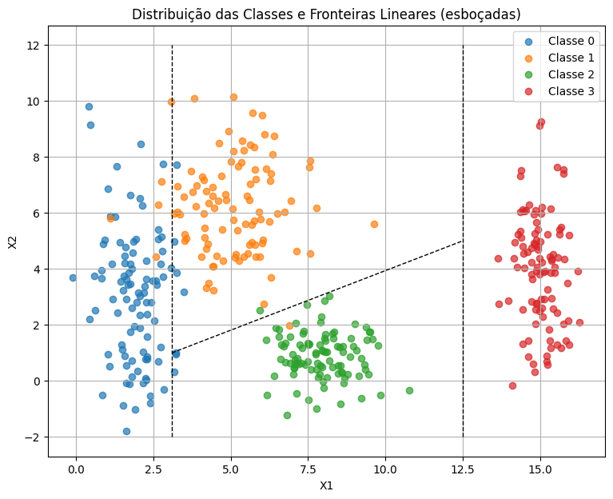
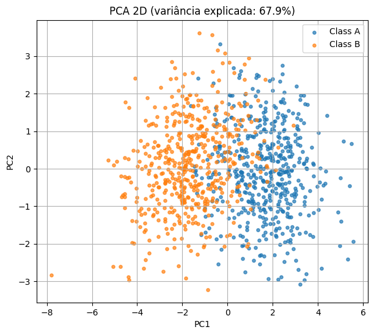
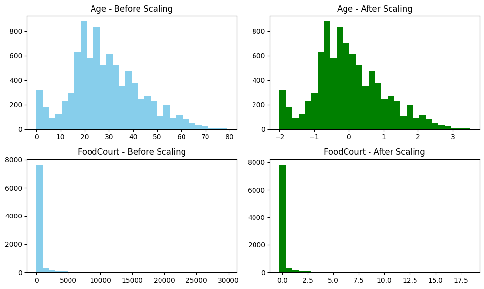

# 1. Data

**Atividade**: Preparação e Análise de Dados para Redes Neurais

Esta atividade foi projetada para testar suas habilidades na geração de conjuntos de dados sintéticos, no tratamento de desafios de dados do mundo real e na preparação de dados para serem inseridos em redes neurais.

---

## 1.1 Analisar e Traçar Limites 
(Exercício 1)

Neste exercício exploramos a separabilidade em 2D para entender como diferentes distribuições de classes afetam a definição de fronteiras de decisão.

**Distribuição das classes:**

* A **Classe 0** (azul) está concentrada em torno do ponto `[2, 3]`, com maior dispersão no eixo vertical (X2).
* A **Classe 1** (laranja) aparece próxima a `[5, 6]`, relativamente mais acima, mas parcialmente sobreposta à Classe 0 no eixo X1.
* A **Classe 2** (verde) está em `[8, 1]`, mais isolada, formando um cluster compacto e bem separado das Classes 0 e 1.
* A **Classe 3** (vermelha) está distante, em `[15, 4]`, praticamente sem sobreposição com as demais.

**Sobreposição:**

* Existe sobreposição visível entre **Classe 0 e Classe 1**, principalmente nos limites superiores e inferiores.
* As Classes 2 e 3 aparecem mais isoladas e são mais facilmente separáveis.

**Limites lineares:**

* Uma única fronteira linear **não conseguiria separar todas as classes simultaneamente**.
* Algumas classes, no entanto, poderiam ser separadas com limites simples:

  * Classe 3 pode ser isolada com uma linha vertical.
  * Classe 2 pode ser separada da Classe 0/1 com uma linha inclinada.
  * Classe 0 e 1 exigem uma fronteira mais complexa devido à sobreposição.

**Rede Neural:**

* Uma rede neural com funções de ativação não lineares (ex.: `tanh` ou `ReLU`) poderia aprender **fronteiras curvas** para separar Classe 0 e Classe 1 com maior precisão.
* Assim, enquanto limites lineares funcionam para parte do espaço, apenas uma rede neural é capaz de capturar fronteiras mais flexíveis e reduzir erros nas regiões de sobreposição.

---

## 1.2 Não-linearidade em dimensões superiores 
(Exercício 2)

Este exercício demonstra a importância da redução de dimensionalidade e mostra como dados em dimensões mais altas podem se tornar complexos para modelos lineares.

**Relacionamento entre as classes:**

Na projeção 2D obtida via PCA, as Classes A (azul) e B (laranja) aparecem como dois grupos com regiões predominantes distintas. A Classe A se concentra mais à direita do eixo PC1, enquanto a Classe B aparece mais à esquerda. Entretanto, há uma região central significativa em que os pontos das duas classes se sobrepõem, indicando que não existe separação perfeita na projeção.

**Separabilidade linear:**

Os dados não são totalmente separáveis por uma fronteira linear simples. Uma reta até poderia dividir aproximadamente as classes em lados opostos, mas haveria muitos erros de classificação devido à sobreposição. Isso mostra que **modelos lineares não conseguem capturar toda a complexidade da distribuição**.

**Por que é um desafio para modelos lineares:**

Esse tipo de estrutura de dados é desafiador porque as classes não seguem fronteiras lineares bem definidas. A diferença de covariâncias faz com que os aglomerados tenham formatos e dispersões distintas, e a projeção em 2D comprime ainda mais a separabilidade. Assim, **um modelo linear simples não seria capaz de traçar fronteiras adequadas**, enquanto uma rede neural multicamadas com funções de ativação não lineares pode aprender **fronteiras de decisão curvas e adaptativas**, reduzindo os erros nas áreas de sobreposição.

---

## 1.3 Preparando dados do mundo real para uma rede neural 
(Exercício 3)

Este exercício usa o dataset real **Spaceship Titanic** para demonstrar como dados brutos precisam ser limpos e transformados antes de alimentar uma rede neural com função de ativação `tanh`.

**Objetivo do dataset Spaceship Titanic:**

  * Prever se um passageiro foi **transportado para outra dimensão** após a colisão da nave.
  * A variável alvo é **`Transported`**, binária (`True`/`False`).

**Features:**

  * **Numéricas:** `Age`, `RoomService`, `FoodCourt`, `ShoppingMall`, `Spa`, `VRDeck`.
  * **Categóricas:** `HomePlanet`, `CryoSleep`, `Cabin` (decomposta em `Deck` e `Side`), `Destination`, `VIP`, `Name`.

**Valores ausentes:**

  * Detectados em diversas colunas: `Age`, `HomePlanet`, `CryoSleep`, `Destination`, `VIP`, `Cabin` e nos gastos (`RoomService`, `FoodCourt`, `ShoppingMall`, `Spa`, `VRDeck`).
  * Isso reforça a necessidade de um pré-processamento adequado antes do treino.

**Tratamento de missing values:**

  * **Numéricas:** preenchidas com a **mediana** (robusta a outliers).
  * **Categóricas:** substituídas pelo **valor mais frequente (mode)**.
  * **Booleanas:** (`CryoSleep`, `VIP`) → preenchidas com `False`.
  * **Cabin:** decomposta em `Deck` e `Side`, ausentes preenchidos como `"Unknown"`.

* **Codificação de variáveis categóricas:**

  * Aplicado **One-Hot Encoding**, criando colunas binárias para cada categoria.
  * Essa abordagem evita impor relações artificiais entre categorias (ex.: `HomePlanet` ≠ ordinal).

**Escalonamento (scaling):**

  * Aplicada **padronização (Z-score)** às variáveis numéricas.
  * Fórmula: $x' = \frac{x - \mu}{\sigma}$.
  * Justificativa: como a função de ativação **tanh** gera saídas em \[-1,1] e é centrada em 0, dados padronizados aceleram o aprendizado e evitam saturação em valores extremos.

**Resultados dos gráficos (antes vs depois do scaling):**

  * **Age:** antes variava de 0 a 80, concentrada entre 20–40. Depois do scaling, a distribuição ficou **centrada em 0**, variando entre aproximadamente -2 e +3. Isso mostra que a padronização funcionou corretamente.
  * **FoodCourt:** antes apresentava forte assimetria, com a maioria dos valores próximos de 0 e alguns passageiros com gastos altíssimos (outliers acima de 20.000). Depois do scaling, a variável também ficou ajustada em torno de 0, mas **a assimetria permaneceu visível**, evidenciando que o **Z-score não elimina outliers, apenas ajusta escala e média**.
  * Essa análise mostra que variáveis como `Age` ficam mais bem distribuídas após padronização, enquanto variáveis de gastos poderiam se beneficiar de uma transformação extra (ex.: log) antes do scaling.

---

**Conclusão – impacto do pré-processamento**

  O pré-processamento foi essencial para tornar o conjunto de dados adequado ao treinamento de uma rede neural com função de ativação `tanh`. O tratamento de valores ausentes garantiu consistência, enquanto a codificação one-hot transformou variáveis categóricas em formato numérico sem distorções. A padronização centrou e normalizou as variáveis numéricas, alinhando-as à faixa de saída da `tanh` (\[-1,1]) e facilitando a convergência do modelo. A análise gráfica mostrou ganhos claros, como no caso de `Age`, que ficou bem distribuída após o scaling, e destacou limitações, como em `FoodCourt`, onde outliers mantiveram a assimetria. No geral, o processo resultou em dados limpos, consistentes e devidamente escalados, formando uma base sólida para o treinamento de redes neurais.

---

