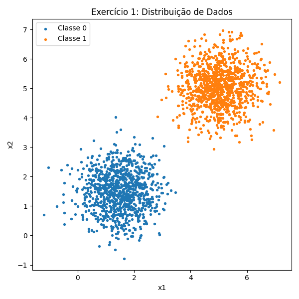
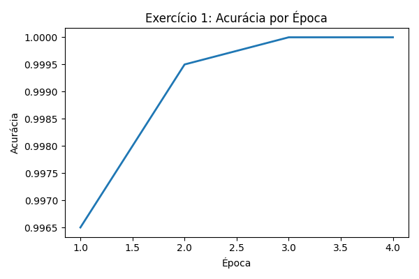
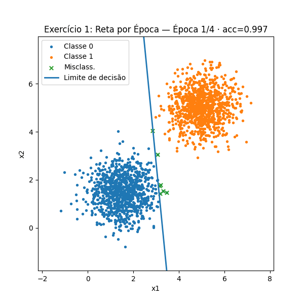
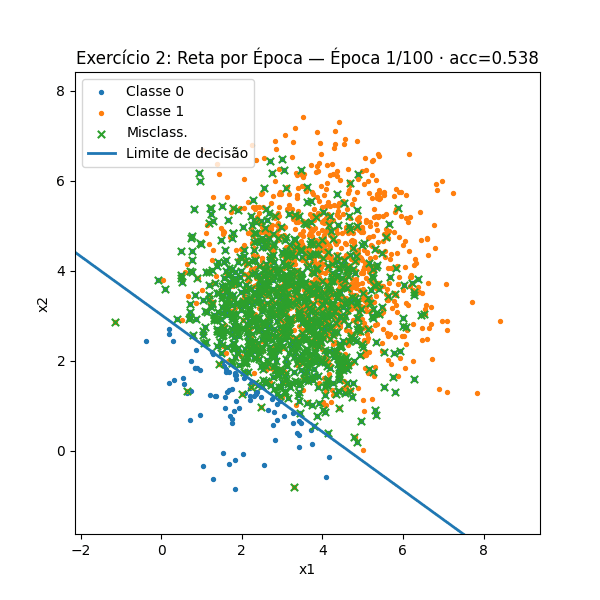

# Relatório — Perceptron e suas Limitações

## Parte 1 — Dados Linearmente Separáveis

### Geração de Dados
Foram geradas 2.000 amostras (1.000 por classe) a partir de distribuições normais multivariadas:
- **Classe 0**: média `[1.5, 1.5]`, covariância `[[0.5, 0], [0, 0.5]]`.
- **Classe 1**: média `[5, 5]`, covariância `[[0.5, 0], [0, 0.5]]`.

Esses parâmetros garantem **separabilidade linear** quase perfeita, com sobreposição mínima.



### Treinamento do Perceptron
- Pesos inicializados próximos de zero.
- Taxa de aprendizado: η = 0.01.
- Critério de parada: convergência (nenhuma atualização numa época) ou 100 épocas.

### Resultados
- **Convergência em 4 épocas**.  
- Pesos finais: `w = [0.0369, 0.0675]`.  
- Bias final: `b = -0.33`.  
- Acurácia final: **100% (2000/2000 corretos)**.  

        ===== Exercício 1 =====
        Convergiu: True | Épocas: 4
        w_final: [0.036892 0.067545] | b_final: -0.33
        Acurácia final: 1.0
        Erros: 0 de 2000
        GIF salvo em: ex1.gif

Curva de acurácia ao longo das épocas:



GIF mostrando a reta de decisão mudando a cada época:



### Discussão
- O Perceptron convergiu rapidamente porque os dados são **linearmente separáveis**.
- A fronteira de decisão encontrada separa perfeitamente as duas classes.
- Mostra a eficácia do Perceptron em cenários simples.

---

## Parte 2 — Dados Parcialmente Sobrepostos

### Geração de Dados
Foram geradas 2.000 amostras (1.000 por classe) a partir de distribuições normais multivariadas:
- **Classe 0**: média `[3, 3]`, covariância `[[1.5, 0], [0, 1.5]]`.
- **Classe 1**: média `[4, 4]`, covariância `[[1.5, 0], [0, 1.5]]`.

Neste caso, as médias estão mais próximas e a variância é maior, causando **sobreposição significativa**.


### Treinamento do Perceptron
- Mesmo setup do exercício anterior.
- Executado por até 100 épocas.

### Resultados
- **Não convergiu** em 100 épocas.  
- Pesos finais: `w = [0.0637, 0.0696]`.  
- Bias final: `b = -0.42`.  
- Acurácia final: **~69.6% (1392/2000 corretos, 608 erros)**.  

        ===== Exercício 2 =====
        Convergiu: False | Épocas: 100
        w_final: [0.063667 0.069554] | b_final: -0.42
        Acurácia final: 0.696
        Erros: 608 de 2000
        GIF salvo em: ex2.gif

Curva de acurácia mostra **oscilações constantes**:


GIF mostrando a reta de decisão mudando mas sem encontrar separação perfeita:



### Discussão
- O Perceptron não atingiu convergência, pois os dados **não são linearmente separáveis**.
- A acurácia máxima ficou limitada (~70%), com grande número de pontos mal classificados.
- Esse resultado ilustra bem a **limitação do Perceptron** quando a hipótese de separabilidade linear não é atendida.

---

## Conclusão Geral
- **Parte 1 (Linearmente Separáveis):** o Perceptron convergiu rápido e obteve acurácia de 100%.  
- **Parte 2 (Não Linearmente Separáveis):** o Perceptron não convergiu e ficou limitado a ~70% de acurácia.  

Esses experimentos mostram que o Perceptron é eficiente apenas em cenários onde existe uma fronteira linear clara. Para problemas mais complexos, são necessárias arquiteturas mais sofisticadas, como **MLPs (Multi-Layer Perceptrons)** ou outros modelos de classificação.


## Código-Fonte

A seguir apresentamos a implementação do Perceptron **seguindo os 7 passos do processo de treinamento** (inicialização, fornecimento dos dados, forward pass, cálculo do erro, atualização dos parâmetros, iteração por épocas e verificação de convergência). O código foi separado em funções para facilitar a visualização de cada etapa.

``` python

    import numpy as np
    import matplotlib.pyplot as plt
    from matplotlib import animation

    def set_seed(seed=42):
        np.random.seed(seed)

    def make_dataset(mean0, cov0, mean1, cov1, n_per_class=1000, seed=42):
        set_seed(seed)
        X0 = np.random.multivariate_normal(mean0, cov0, n_per_class)
        X1 = np.random.multivariate_normal(mean1, cov1, n_per_class)
        X = np.vstack([X0, X1])
        y = np.hstack([np.zeros(n_per_class), np.ones(n_per_class)]).astype(int)
        # embaralha
        idx = np.arange(len(X))
        np.random.shuffle(idx)
        return X[idx], y[idx]

    def perceptron_fit(X, y, lr=0.01, max_epochs=100, seed=0):
        """
        Treina perceptron online tradicional (sem classe).
        Retorna um dicionário com histórico para animar/avaliar.
        Perceptron online: atualiza w,b a cada amostra.
        """
        set_seed(seed) # para reprodutibilidade
        n, d = X.shape # n amostras, d dimensões (features)
        w = np.random.randn(d) * 0.01 # inicializa w pequeno
        b = 0.0                     # inicializa b = 0 (bias)

        ws, bs, accs, preds_hist = [], [], [], [] # histórico por época
        converged = False # se parou antes do max_epochs
        epochs_run = max_epochs # quantas épocas rodou de fato 

        for epoch in range(1, max_epochs + 1): 
            updates = 0
            for i in range(n):
                xi = X[i] # amostra i
                yi = y[i] # label i
                y_hat = 1 if (np.dot(xi, w) + b) >= 0 else 0 # predição (y predito binário)
                if y_hat != yi: # só atualiza se errou
                    delta = (yi - y_hat)          # +1 ou -1
                    w = w + lr * delta * xi # atualiza w
                    b = b + lr * delta    # atualiza b
                    updates += 1

            # fim da época: calcula acurácia

            scores = X @ w + b 
            '''
            @ em Python faz multiplicação de matrizes (produto matricial)
            X: geralmente é uma matriz (por exemplo, de dados de entrada, onde cada linha é 
                                        uma amostra e cada coluna é uma característica/feature).
            w: normalmente é um vetor de pesos (ou coeficientes) para cada característica.
            b: é um viés (bias), geralmente um escalar ou vetor.

            Calcula uma combinação linear dos dados de entrada (X), ponderada pelos pesos (w),
            e soma o viés (b). O resultado (scores) normalmente representa as predições de um 
            modelo linear, como regressão linear ou a camada de saída de uma rede neural simples.
            '''
            y_pred = (scores >= 0).astype(int)  # essa linha transforma os scores lineares em predições binárias (0 ou 1), 
                                                # usando a função degrau (step function) do perceptron.
            '''
            o score pode ser negativo, zero ou positivo dependendo de onde o ponto
            x está em relação à reta (no 2D) ou hiperplano (em dimensões maiores)
            O zero é exatamente a fronteira de decisão: os pontos que satisfazem
            w⋅x+b=0
            estão em cima da reta de decisão.
            Se um ponto dá score > 0, ele está de um lado da reta.
            Se dá score < 0, ele está do outro lado.
            '''
            acc = (y_pred == y).mean() # acurácia da época, média de acertos
                                    # (y_pred==y) é um array booleano, compara elemento a elemento,
                                    # True=acertou, False=errou; .mean() dá a média de acertos (True=1, False=0)
            # salva histórico
            ws.append(w.copy())
            bs.append(float(b))
            accs.append(float(acc))
            preds_hist.append(y_pred)
            # critério de parada: se não teve atualização, parou
            # como assim se nao teve atualizacao? se o perceptron acertou todas as amostras
            if updates == 0:
                converged = True # parou antes do max_epochs
                epochs_run = epoch # quantas épocas rodou de fato
                break

        return {
            "ws": ws,             # lista de w por época (np.array shape (2,))
            "bs": bs,             # lista de b por época (float)
            "accs": accs,         # acurácia por época
            "preds_hist": preds_hist,  # predições por época
            "converged": converged,
            "epochs_run": epochs_run,
            "w_final": ws[-1],
            "b_final": bs[-1],
            "y_pred_final": preds_hist[-1],
        }
```