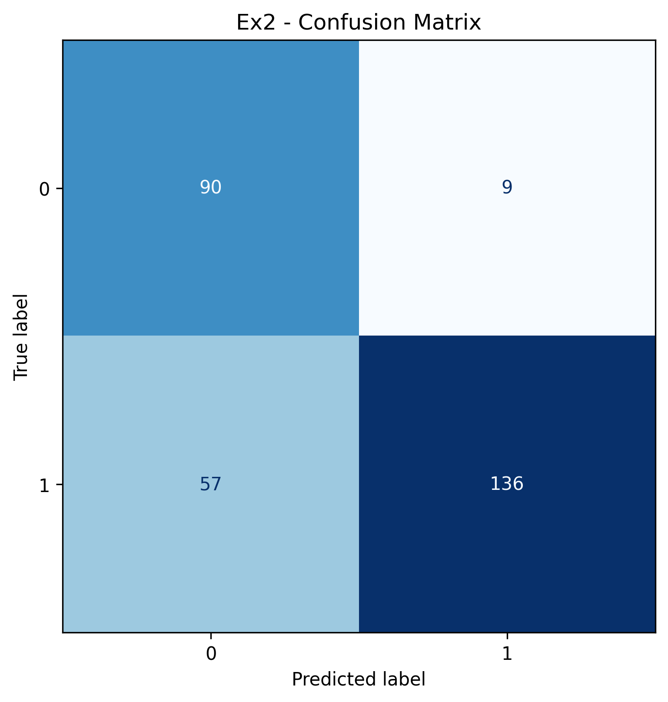

# Relatório - Multi-Layer Perceptrons (MLPs)

Este relatório apresenta os resultados obtidos nos exercícios 1, 2, 3 e 4, que envolvem a implementação e avaliação de redes neurais do tipo Multi-Layer Perceptron (MLP) aplicadas a problemas de classificação binária e multiclasse.

---
## CÓDIGOS EM:
  
---

## Exercício 1 - Forward e Backpropagation Manual

**Configuração inicial:**
- Entrada: $x = [0.5, -0.2]$
- Saída esperada: $y = 1.0$
- Pesos e vieses:

$$
W^{(1)} =
\begin{bmatrix}
0.3 & -0.1 \\
0.2 & 0.4
\end{bmatrix},
\quad
b^{(1)} = [0.1, -0.2]
$$

$$
W^{(2)} =
\begin{bmatrix}
0.5 \\
-0.3
\end{bmatrix},
\quad
b^{(2)} = 0.2
$$

- Taxa de aprendizado: $\eta = 0.3$  
- Função de ativação: $\tanh$  
- Função de custo: MSE

### Forward Pass
- Pré-ativação camada oculta:  
  $z^{(1)} = [0.21, -0.33]$
- Ativação camada oculta:  
  $h = [0.206966, -0.318521]$
- Pré-ativação saída:  
  $z^{(2)} = 0.399039$
- Saída final:  
  $\hat{y} = 0.379127$
- Função de perda:  
  $L = 0.192742$

### Backpropagation
- Gradiente na saída:  
  $\delta^{(2)} = -0.531631$
- Gradientes da camada de saída:  
  $\frac{\partial L}{\partial W^{(2)}} = [-0.110030, \ 0.169335]^T$,  
  $\frac{\partial L}{\partial b^{(2)}} = -0.531631$
- Gradiente na camada oculta:  
  $\delta^{(1)} = [-0.254429, \; 0.143308]$
- Gradientes da camada oculta:

$$
\frac{\partial L}{\partial W^{(1)}} =
\begin{bmatrix}
-0.127215 & 0.071654 \\
0.050886 & -0.028662
\end{bmatrix},
\quad
\frac{\partial L}{\partial b^{(1)}} = [-0.254429, \ 0.143308]
$$

### Atualização dos Parâmetros
Após o update com $\eta = 0.3$:

$$
W^{(2)} =
\begin{bmatrix}
0.533009 \\
-0.350801
\end{bmatrix},
\quad
b^{(2)} = 0.359489
$$

$$
W^{(1)} =
\begin{bmatrix}
0.338164 & -0.121496 \\
0.184734 & 0.408598
\end{bmatrix},
\quad
b^{(1)} = [0.176329, -0.242992]
$$

### Forward Após Atualização
- Nova saída: $\hat{y}' = 0.570172$  
- Novo erro: $L' = 0.092376$

**Conclusão**: após uma única atualização, a perda caiu de **0.1927 → 0.0924**, mostrando que o backpropagation ajustou corretamente os parâmetros.

---

## Exercício 2 - Classificação Binária

- **Curva de Loss**:  
  

- **Matriz de Confusão**:  
  

**Resumo:**
- Classe 0: 90 acertos, 9 erros.  
- Classe 1: 136 acertos, 57 erros.  
- **Acurácia total: 77.4%**

| Classe | Precisão | Recall | F1-score |
|--------|----------|--------|----------|
| 0      | 0.6122   | 0.9091 | 0.7317   |
| 1      | 0.9379   | 0.7047 | 0.8047   |

---

## Exercício 3 - Classificação em 3 Classes

- **Curva de Loss**:  
  

- **Matriz de Confusão**:  
  

**Resumo:**
- Classe 0: 85 acertos, 15 erros.  
- Classe 1: 70 acertos, 30 erros.  
- Classe 2: 74 acertos, 26 erros.  
- **Acurácia total: 76.3%**

| Classe | Precisão | Recall | F1-score |
|--------|----------|--------|----------|
| 0      | 0.7944   | 0.8500 | 0.8213   |
| 1      | 0.8140   | 0.7000 | 0.7527   |
| 2      | 0.6916   | 0.7400 | 0.7150   |

---

## Exercício 4 - MLP Mais Profundo (3 Classes)

- **Curva de Loss**:  
  

- **Matriz de Confusão**:  
  

**Resumo:**
- Classe 0: 91 acertos, 9 erros.  
- Classe 1: 75 acertos, 25 erros.  
- Classe 2: 78 acertos, 22 erros.  
- **Acurácia total: 81.3%**

| Classe | Precisão | Recall | F1-score |
|--------|----------|--------|----------|
| 0      | 0.8505   | 0.9100 | 0.8792   |
| 1      | 0.8065   | 0.7500 | 0.7772   |
| 2      | 0.7800   | 0.7800 | 0.7800   |

---

## Comparativo Geral

- **Curvas de Loss (Ex2, Ex3, Ex4)**:  
  

**Conclusões:**
- O modelo simples (Ex2) teve desempenho razoável (77%), mas com desequilíbrio entre classes.  
- O Ex3 ampliou a rede para 3 classes, mantendo acurácia próxima de 76%.  
- O Ex4, com arquitetura mais profunda, apresentou o melhor resultado (81%), além de convergência mais rápida.  

**O aumento da profundidade melhorou a capacidade de generalização da rede, reduzindo a perda final e aumentando a acurácia geral.**
