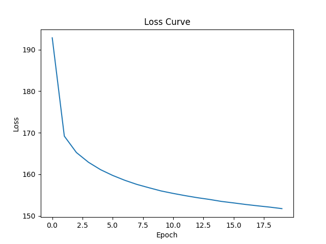
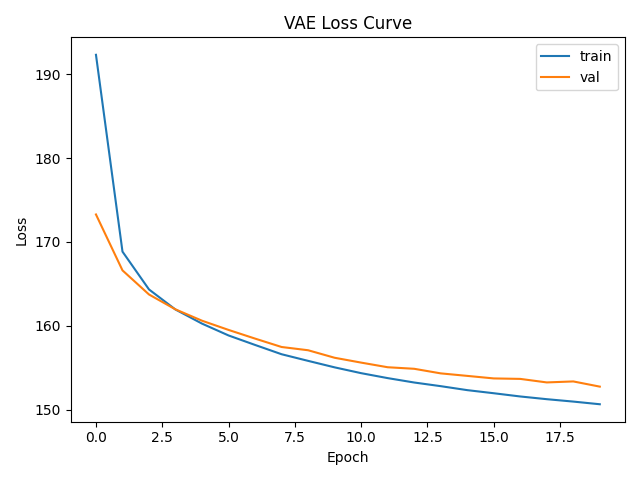
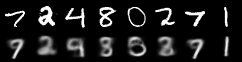
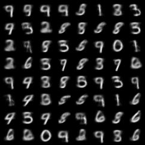
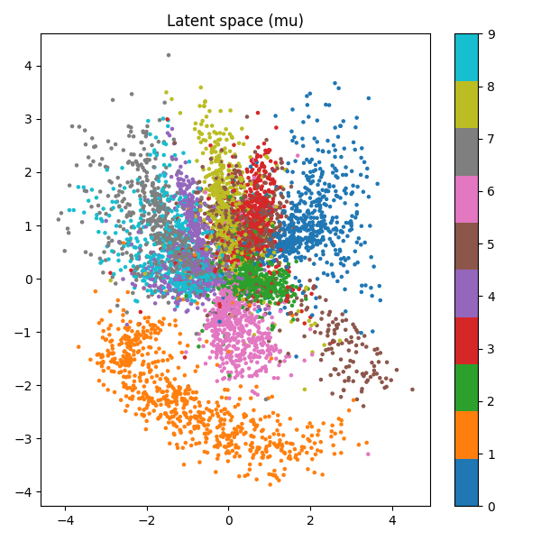
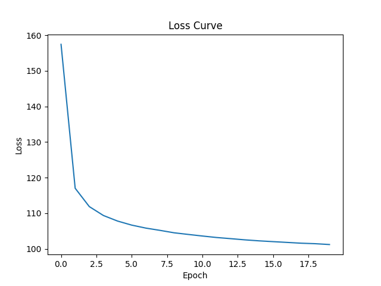
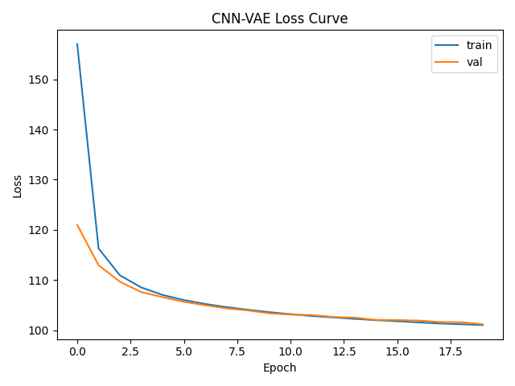
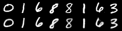
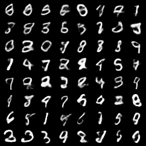
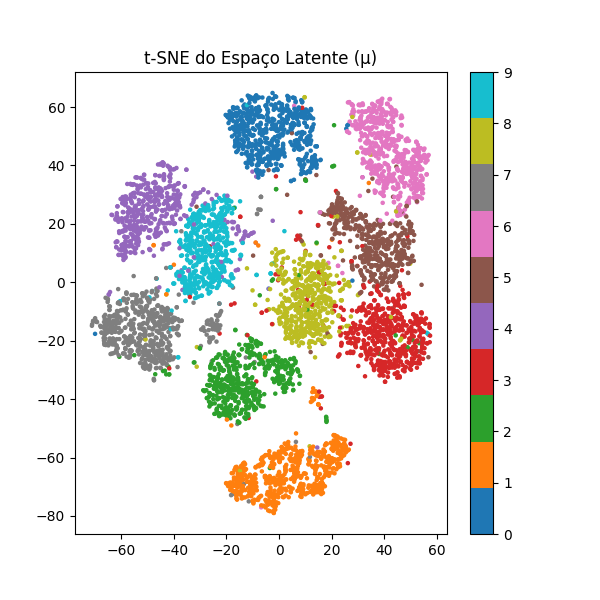

# Variational Autoencoder (VAE) – MNIST

## CÓDIGOS EM:
  [](https://github.com/marinnagc/ann-dl-marinnagc/tree/main/Exercises/VAE)

## Objetivo

O objetivo desta atividade foi **implementar, treinar e compreender um Variational Autoencoder (VAE)**, aplicando-o ao dataset **MNIST**.
O modelo aprende uma representação **latente probabilística e contínua** dos dígitos, capaz de **reconstruir** e **gerar novas imagens** semelhantes.

---

## Introdução teórica

O **VAE** é um tipo de **autoencoder probabilístico**, ou seja, ele aprende a mapear cada entrada ( x ) para uma **distribuição normal** no espaço latente, e não para um ponto fixo.

### Estrutura geral

* **Encoder:** recebe uma imagem e produz dois vetores — a média ($\mu$) e o logaritmo da variância ($\log\sigma^2$) da distribuição latente.
* **Reparametrização:** garante que o processo de amostragem seja diferenciável, usando $z = \mu + \sigma \cdot \varepsilon$, com $\varepsilon \sim \mathcal{N}(0, 1)$.
* **Decoder:** reconstrói a imagem original a partir de $z$.
* **Loss total:**

$$
L = \text{Loss de Reconstrução} + \text{KL Divergência}
$$

  onde:
  * A **reconstrução (BCE)** mede o quão parecida é a saída com a entrada.
  * A **KL Divergência** força o espaço latente a seguir uma distribuição normal padrão, criando um espaço contínuo e suave para gerar novas amostras.

---

## Implementação

### Dataset

* Dataset utilizado: **MNIST** (dígitos escritos à mão).
* Normalizado para o intervalo **[0, 1]**.
* Divisão: **90% para treino**, **10% para validação**.

### Estrutura do modelo

| Parte                | Descrição                                      |
| -------------------- | ---------------------------------------------- |
| **Encoder**          | Recebe imagem (28×28) → gera vetores μ e logσ² |
| **Reparametrização** | Amostra z = μ + σ·ε (permite backprop)         |
| **Decoder**          | Reconstrói a imagem a partir de z              |
| **Loss**             | BCE + KL Divergência                           |

Implementado de forma direta e eficiente em **PyTorch**, com codificação modular dentro da classe `VAE`.

---

## Hiperparâmetros

| Hiperparâmetro | Valor      |
| -------------- | ---------- |
| Dataset        | MNIST      |
| Latent dim     | 2          |
| Hidden layer   | 400 (fixo) |
| Batch size     | 128        |
| Learning rate  | 1e-3       |
| Epochs         | 20         |
| Loss           | BCE + KL   |

---

## Treinamento

Durante o forward pass:

1. `x → (μ, log σ²)` — Encoder: mapeia a entrada para média e log‑variância.  
2. `(μ, σ) → z = μ + σ · ε`, com `ε ~ N(0, 1)` — Reparametrização (amostragem diferenciável).  
3. `z → x̂` — Decoder: reconstrói a entrada a partir de `z`.  
4. `L = L_rec + L_KL` — Loss total: perda de reconstrução (`L_rec`, ex.: BCE) + divergência KL (`L_KL`).

Durante o backpropagation:

* O gradiente da **reconstrução** ensina o modelo a reproduzir os dígitos.
* O gradiente da **KL Divergência** regula o espaço latente, evitando colapso.

---

## Curva de perda




> Observa-se uma queda progressiva e consistente da loss, demonstrando aprendizado estável e sem overfitting.

        Epoch 1  | Loss: 10413612.39
        Epoch 2  | Loss: 9136260.22
        Epoch 3  | Loss: 8923109.34
        Epoch 4  | Loss: 8796323.19
        Epoch 5  | Loss: 8700150.73
        Epoch 6  | Loss: 8625501.69
        Epoch 7  | Loss: 8562464.97
        Epoch 8  | Loss: 8508978.16
        Epoch 9  | Loss: 8465627.10
        Epoch 10 | Loss: 8424139.31
        Epoch 1  | Loss: 10413612.39
        Epoch 2  | Loss: 9136260.22
        Epoch 3  | Loss: 8923109.34
        Epoch 4  | Loss: 8796323.19
        Epoch 5  | Loss: 8700150.73
        Epoch 6  | Loss: 8625501.69
        Epoch 7  | Loss: 8562464.97
        Epoch 8  | Loss: 8508978.16
        Epoch 9  | Loss: 8465627.10
        Epoch 10 | Loss: 8424139.31
        Epoch 4  | Loss: 8796323.19
        Epoch 5  | Loss: 8700150.73
        Epoch 6  | Loss: 8625501.69
        Epoch 7  | Loss: 8562464.97
        Epoch 8  | Loss: 8508978.16
        Epoch 9  | Loss: 8465627.10
        Epoch 10 | Loss: 8424139.31
        Epoch 7  | Loss: 8562464.97
        Epoch 8  | Loss: 8508978.16
        Epoch 9  | Loss: 8465627.10
        Epoch 10 | Loss: 8424139.31
        Epoch 9  | Loss: 8465627.10
        Epoch 10 | Loss: 8424139.31
        Epoch 10 | Loss: 8424139.31
        Epoch 11 | Loss: 8391912.65
        Epoch 12 | Loss: 8362784.71
        Epoch 13 | Loss: 8336323.15
        Epoch 14 | Loss: 8313849.49
        Epoch 15 | Loss: 8287752.75
        Epoch 16 | Loss: 8268472.75
        Epoch 17 | Loss: 8248185.89
        Epoch 18 | Loss: 8230381.74
        Epoch 19 | Loss: 8213708.92
        Epoch 20 | Loss: 8194243.20
---

## Resultados visuais

### Reconstruções

**Entrada (acima)** vs **Reconstruída (abaixo):**



> As reconstruções na última época mostram que o modelo aprendeu bem os padrões principais de cada dígito, com alguns borrões leves esperados para espaços latentes reduzidos (2D).

---

### Amostras aleatórias do espaço latente

**Amostras geradas a partir de** ( z \sim \mathcal{N}(0, I) ):



> As amostras são realistas e variadas, provando que o modelo aprendeu um espaço latente capaz de **gerar novos dígitos coerentes** com o domínio MNIST.

---
### Espaço Latente



---

## Discussão

| Aspecto            | Observação                                                                               |
| ------------------ | ---------------------------------------------------------------------------------------- |
| **Reconstrução**   | Boa fidelidade com pequenas perdas de detalhes (esperado em latente 2D)                  |
| **Espaço latente** | Suportou geração de amostras realistas mesmo com dimensão reduzida                       |
| **Simplicidade**   | Arquitetura enxuta (Linear → ReLU → Linear) permite fácil entendimento e boa performance |
| **Treinamento**    | Estável, sem overfitting, e convergente com apenas 20 épocas                             |

---

## Conclusões

* O modelo foi capaz de aprender a **reconstruir e gerar** imagens coerentes de dígitos manuscritos.
* Mesmo com uma arquitetura **simples e leve**, o desempenho foi eficaz.
* O VAE apresentou comportamento esperado, equilibrando reconstrução com regularização.

---

## Possíveis melhorias
---

### 1. **Aumentar a Dimensão do Espaço Latente**

* **Problema atual:** `latent_dim = 2` é ótimo para visualizar o espaço, mas **limita muito a expressividade**.
* **Solução:** Tente aumentar para `8`, `16`, ou até `32`.
* **Impacto:** O modelo terá **mais capacidade de codificar detalhes** da imagem.
* **Custo:** Reduz a possibilidade de visualização direta (mas pode usar t-SNE).

```python
LATENT_DIM = 16
```

---

### 2. **Adicionar mais camadas ou neurônios (Encoder/Decoder mais profundos)**

* **Problema atual:** O encoder/decoder tem apenas **uma camada oculta de 400 neurônios**.
* **Solução:** Usar mais camadas ou aumente o tamanho de cada uma.
* Exemplo:

```python
self.encoder = nn.Sequential(
    nn.Linear(784, 512),
    nn.ReLU(),
    nn.Linear(512, 256),
    nn.ReLU()
)
```

* **Impacto:** Permite aprender **representações mais complexas**, melhorando a qualidade visual.
* **Custo:** Tempo de treino maior.

---

### 3. **Trocar MLP por Camadas Convolucionais (CNN-VAE)**

* **Problema:** MLPs ignoram a **estrutura espacial da imagem**.
* **Solução:** Usar CNNs no encoder e decoder para **preservar padrões visuais locais** (linhas, curvas, etc).
* Exemplo: `Conv2d → ReLU → Flatten → FC` no encoder, e `FC → Reshape → ConvTranspose2d` no decoder.
* **Impacto:** Qualidade das reconstruções **melhora drasticamente**.
* **Custo:** Código mais complexo e mais pesado.

---

### 4. **Treinar por mais épocas (ex: 40+)**

* **Problema:** Com apenas 20 épocas, o modelo ainda está aprendendo.
* **Solução:** Continuar o treinamento até a curva de loss **estabilizar bem**.
* **Impacto:** Resultados geralmente continuam melhorando por mais 20–30 épocas.
* **Dica:** Use `torch.save()` para salvar o modelo ao final.

---

### 5. **Técnicas de regularização**

* **Warm-up ou Annealing da KL**:

  * Comece com `β=0` e aumente gradualmente.
  * Isso evita que o modelo ignore o latente no início.
* **Early Stopping ou Dropout:** Se usar redes maiores, ajuda a prevenir overfitting.

---

### 6. **Augmentação de Dados**

* Pode usar **pequenas rotações, shifts e ruídos leves** para ajudar o VAE a generalizar.

```python
transform = transforms.Compose([
    transforms.RandomAffine(degrees=10, translate=(0.1, 0.1)),
    transforms.ToTensor()
])
```

---

### 7. **Experimentar com β-VAE ou VQ-VAE**

* Modelos como o **β-VAE** (com β > 1) ajudam a controlar a **disentanglement** do latente.
* O **VQ-VAE** usa vetores discretos no espaço latente e pode produzir amostras muito mais nítidas — usado em modelos como DALL·E!

---

## Plano de melhorias:

1. Aumente `LATENT_DIM = 16`
2. Aumente para `EPOCHS = 40`
3. Use `hidden = 512` ou mais
4. Trocar o MLP por CNNs

## VAE com Arquitetura Convolucional (CNN-VAE)

Variational Autoencoder com arquitetura convolucional, o **CNN-VAE**.

### Motivação

O MLP ignora a **estrutura espacial** da imagem (relações locais entre pixels), o que pode gerar **reconstruções borradas ou desconexas**. Usar **convoluções no encoder e transposed convolutions no decoder** permite capturar **padrões locais** como bordas, curvas e simetrias — essenciais para desenhar dígitos com precisão.

---

## Estrutura do CNN-VAE

### **Encoder (convolucional)**

| Camada                    | Saída             |
| ------------------------- | ----------------- |
| `Conv2d(1, 32, 4, 2, 1)`  | `[B, 32, 14, 14]` |
| `ReLU`                    |                   |
| `Conv2d(32, 64, 4, 2, 1)` | `[B, 64, 7, 7]`   |
| `Flatten()`               | `[B, 3136]`       |
| `Linear(3136 → LATENT)`   | μ e logσ²         |

### **Decoder (transposed convolucional)**

| Camada                             | Saída              |
| ---------------------------------- | ------------------ |
| `Linear(LATENT → 3136)`            | `[B, 3136]`        |
| `Reshape`                          | `[B, 64, 7, 7]`    |
| `ConvTranspose2d(64, 32, 4, 2, 1)` | `[B, 32, 14, 14]`  |
| `ReLU`                             |                    |
| `ConvTranspose2d(32, 1, 4, 2, 1)`  | `[B, 1, 28, 28]`   |
| `Sigmoid`                          | Normalização final |

---

## Configurações utilizadas

| Hiperparâmetro | Valor               |
| -------------- | ------------------- |
| Dataset        | MNIST               |
| Latent dim     | 16                  |
| Batch size     | 128                 |
| Learning rate  | 1e-3                |
| Epochs         | 20                  |
| Loss           | BCE + KL            |
| Arquitetura    | CNN (Conv + Deconv) |

---

## Curva de Perda

Durante as 20 épocas, a perda total caiu de forma estável, indicando aprendizado progressivo.

**Figura 4 – Curva de perda do CNN-VAE:**



---

## Resultados Visuais

### Reconstruções com CNN

A figura abaixo mostra os dígitos reais (linha superior) e suas reconstruções pela CNN-VAE (linha inferior), após 20 épocas:

**Figura 5 – Reconstruções do CNN-VAE (época 20):**




> As reconstruções são **mais nítidas, com contornos mais definidos** e melhor preservação de detalhes do dígito original em comparação ao modelo com MLP.

---

### Amostras do Espaço Latente

Amostras totalmente novas geradas a partir de vetores ( z \sim \mathcal{N}(0, I) ):

**Figura 6 – Amostras do CNN-VAE (época 20):**




> A qualidade visual é notavelmente melhor: os dígitos são **mais realistas, diversos e menos borrados**, mesmo com apenas 20 épocas de treinamento.

---
### Espaço Latente



---
## Comparação MLP vs CNN

| Critério     | MLP-VAE                         | CNN-VAE                          |
| ------------ | ------------------------------- | -------------------------------- |
| Reconstrução | Boa, mas com borrões frequentes | Mais precisa e nítida            |
| Amostragem   | OK, mas com formas distorcidas  | Dígitos claros e bem formados    |
| Complexidade | Simples e leve                  | Mais pesado, mas ainda eficiente |
| Arquitetura  | Linear → ReLU → Linear          | Conv2d → ReLU → ConvTranspose2d  |

Além disso, ao comparar os dois espaços latentes, observa-se que o referente ao MLP não separa tão bem as classe de cada
número, justificando a maior dificuldade na reconstrução, mais borrões.
Já no espaço latende do treinamento feito com CNN, as classes ficaram melhores separadas, o que pode ajudar a justificar a 
maior nitidez nos dígitos.
---

## Conclusão sobre o CNN-VAE

* A arquitetura convolucional oferece uma **melhoria significativa na qualidade visual** das saídas, sem comprometer muito a performance.
* Com **dimensão latente 16**, o modelo tem flexibilidade para codificar bem os dígitos.
* Mesmo com poucas épocas, o CNN-VAE já supera o MLP em **reconstrução e geração**.

---

## Referências

* Kingma, D.P., & Welling, M. (2013). *Auto-Encoding Variational Bayes.*
* PyTorch Documentation – [VAE Tutorial](https://pytorch.org/tutorials/beginner/blitz/vae.html)
* Chug, P. & Sharma, A. (2023). *VAEs in PyTorch – PyImageSearch.*

---
